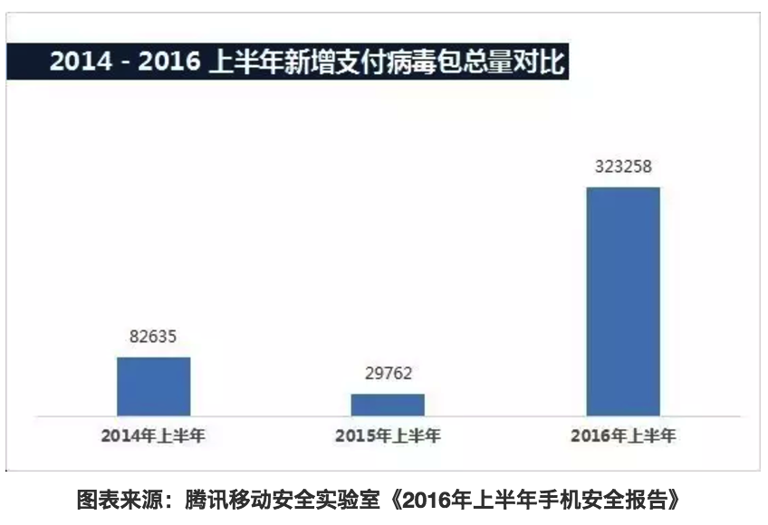

收单机具（POS）未来发展趋势

出处：<http://mp.weixin.qq.com/s?__biz=MzA5MTAwODQwNw==&mid=2652849059&idx=1&sn=813facf4fbf6814e32e9d20cdd429c64&chksm=8be91f5bbc9e964d6caae33ad252c2bde34aaea7bd8455e02dca6e12c9d131101abd8bbf5897&mpshare=1&scene=1&srcid=11225LGQdWpaVQp75HheIzAb#rd>

原创 / 张少飞 周钰 曾望年 

作者供职于中国银联电子支付研究院、电子商务与电子支付国家工程实验室

我国第一台POS诞生于1974年，虽由于应用环境不成熟，未能得到推广。

# POS智能化趋势不可阻挡

POS行业智能化已成公认的趋势：

+ 在互联网巨头的野蛮扩张，移动支付的快速发展，
+ POS刷卡手续费的改革，
+ 聚合支付的需求，
+ 传统POS利润下降及需求降低，
+ 智能设备硬件成本的降低

## 互联网巨头烧钱野蛮扩张，移动支付实现快速发展。

从2010年的团购行业千团大战，到2014年的滴滴、快的打车大战，再到目前激战正酣的外卖大战，互联网行业烧钱能力惊人，仅打车大战半年就烧钱几十亿元。如此烧钱，最终烧出了用户的*移动支付*习惯。

## 刷卡手续费改革，“套码”空间缩小。

根据国家发展改革委、中国人民银行《关于完善银行卡刷卡手续费定价机制的通知》POS机刷卡手续费新标准要求，2016年9月6日开始，POS机刷卡手续费新规定开始实施。信用卡封顶取消，刷借记卡费率降低，民生类商户在本次刷卡手续费调整措施正式实施起2年的过渡期内，按照费率水平保持总体稳定的原则，实行发卡行服务费、网络服务费优惠。

因为此次改革，行业商户可操作空间缩小，民生类商户两年优惠期一过，被迫面临转型压力。

收单机构和服务机构不得不在收单交易之外增加营收，而智能POS多应用智能化管理的特点，正提供了此种能力。

## “云闪付”扫码刷卡一个不能少，商户收银的本质需求。

支付宝和微信在全力推广自己的扫码支付方案，中国银联银行系推出基于HCE的“云闪付”方案。

商户关注的是

+ 收银成本
+ 收银方案覆盖范围，

因此一般不会选择只支持扫码支付方式或“云闪付”支付方式，而是希望收银终端支持所有的支付方式，包括“云闪付”、扫码、刷卡和现金等。

# 智能POS竞争将转变为POS服务平台和整体解决方案的竞争

操作系统上，因为Android的开源性、广泛的用户基础和成熟的产业链，所有智能POS终端都采用了Android作为其智能操作系统。

终端形态上，目前主要分为三大类。

+ 柜面台式、
+ 手持式
+ 组合式

从目前通过“云POS”智能终端产品应用检测上来看，9款为手持式，6款为桌面式，1款为分体式。

在手持式和桌面式两种形态上，各终端厂商的设计大同小异。

网络支持上，均支持WiFi、有线和蜂窝网络。

因此，智能POS在硬件和形态上逐渐趋于同质化，很难脱颖而出。

智能POS竞争的下半场将是智能POS拥有者（收单机构或厂商）的POS服务平台和整体解决方案的竞争。

POS服务平台的能力和整体解决方案的能力才是智能POS真正“智能”的能力，也将成为智能POS的核心竞争力。

POS服务平台的能力包括

+ 终端管理能力、
+ 终端应用管理能力和
+ 商户服务能力等。

其中，终端管理能力包括

+ 终端地理位置追踪能力、
+ 终端开关机状态监控能力、
+ 终端网络流向管理能力、
+ 终端支付渠道远程管理能力、
+ 终端日志远程抓取能力、
+ 终端固件OTA能力、
+ 终端云端备份（云还原能力）和
+ 终端主密钥远程罐装能力等。

终端应用管理能力包括

+ 应用检测能力即安全性、适配性、功能性、稳定性和性能等、
+ 应用版本灵活发布能力即区域发布、灰度发布和商户发布等、
+ 应用远程静默推送安装、更新、卸载能力和应用参数远程配置能力等。

商户服务能力则包括

+ 商户所属终端管理能力、
+ 商户所属终端应用管理能力、
+ 交易按渠道结算报表统计能力、
+ 会员管理能力、
+ 优惠配置核销能力、
+ 支付入口融合能力、
+ 团购及外卖入口融合能力、
+ 人流统计及预测能力和
+ 交易量预测能力等。

整体解决方案的能力与POS服务平台的能力侧重有所不同。

POS服务平台的能力更像是一个大而全的能力平台，择其几块即可服务某类商户。

而整体解决方案能力则侧重于为大型商超或连锁商户提供一揽子解决方案的能力，具体包括

+ 终端侧一体化收银应用开发能力，
+ 服务端商家MIS系统对接能力，
+ 商家支付通道打通或建设能力，
+ 活动或营销开展能力，
+ 客流分析能力和
+ 商场周边服务能力等。

# POS支付功能将弱化，入口作用将凸显

一方面，支付将不再是POS的全部，而是作为商户整个商品售卖流程中的一个环节，其重要性将逐渐弱化。

另一方面，随着POS功能越来越强大，越来越多的外设和传感器与POS集成或连接，互联网高带宽的通信能力，其入口作用进一步凸显，成为线上线下融合的入口。

线上线下融合具体体现在

+ 线上线下商品库存的融合、
+ 线上线下支付方式的融合、
+ 线上线下用户的融合、
+ 线上线下商户服务的融合和
+ 线上线下营销的融合。

Apple Pay等系列“云闪付”在支持线上支付的同时支持线下POS支付，微信、支付宝等提供的二维码扫码支付也从线上走到了线下。

线上购物送线下优惠为线下引流，线下实体店实物体验促进线上销量。

# POS模块化发展

POS作为支付承兑的重要基础设施，而支付是完成商品销售闭环的最重要一环，因此POS也成为众多想要*跨界行业*的必争之地，互联网公司进攻线下市场的重要战场，而POS行业的高壁无疑令其望而生畏。

POS终端的高壁垒主要体现在四个方面：

+ 一是终端研发费用高，这些费用包括产品ID和MD的磨具费用，设备开发、打样、器件等费用，PBOC、QPBOC等检测费用和人员投入费用；
+ 二是开发周期长，每款产品均需要经过规划、ID和MD设计、硬件开发、驱动及安全内核开发、OS开发、软硬件联调和检测认证等阶段；
+ 三是专业人才少，各项开发设计需要约10人左右的专业团队，带领这样的团队的核心人才又是少之又少；
+ 四是专业认证要求高，一款可以上市销售的终端一般需要通过PBOC L1&L2、QPBOC L1&L2、EMV L1&L2、UPTS2.0、PayPass、PayWave、PCI、PTS和POI 4.X等的认证。

一款终端的生命周期长则5年到8年，短则2年到3年即被淘汰。

对于技术能力不够的公司，一款产品从设计到拿到所有检测认证，一年多时间已过，留给该款终端的寿命可想而知。

由此，模块化应运而生。

模块化一般是指以核心板或核心模组的方式完成POS核心业务相关硬件的封装，一般会包括但不限于

+ 安全MCU、
+ Contactless Reader（不包括天线）、
+ Magnetic CardReader（不含刷卡槽）
+ 和Smart Card Reader等，

同时EMV、PBOC、QPBOC的基础协议处理也会在核心板和核心模组中完成封装，只是暴露使用接口API供系统层使用。

模块化无疑将极大程度简化POS的研发难度，加快POS的研发和检测认证进度，减少POS的检测认证费用，一定程度上降低POS准入门槛。

中国银联目前正在就模块化进行规范制定相关工作，后续相关检测认证工作会展开，模块化将成为不可忽视的一个方向和趋势。

# 生物识别技术与智能POS结合将成热点

2015年汉诺威消费电子、信息及通信博览会（CeBIT）开幕式上，马云的Smile to Pay让人脸识别技术火了一把，

Apple Pay 在全球数字支付市场1%的交易额也充分展示了指纹识别在支付应用上的巨大成功。

除此之外，指静脉、手掌静脉、眼纹、虹膜、心电图和语音等生物识别技术逐步成熟，开始在支付领域使用，部分生物识别技术已开始在智能POS应用。

指纹，由于其具有终身不变性、唯一性和方便性，已几乎成为生物特征识别的代名词。

指纹识别技术也是生物识别技术中最为成熟的技术，经过多年的发展，主要分为光学式、电容式和射频式。

光学式作为第一代技术，只能扫描表皮，容易被手模欺骗，已基本不用。

电容式和射频式基于指纹的山谷、山脊成像，准确率高，局否率和误识率均不错，已与智能POS结合，在一些场景中开始使用，成为服务商户的亮点。

典型场景有收银员换班环节：换班收银员输入用户名、密码开始收银，尤其在手持POS上操作不便。

而加入指纹识别模块后，换班收银员只需按下指纹即可完成，缩短了换班时间。

另外，指静脉识别技术通过近红外线穿透人体手指所取得的静脉血管图形来识别人员的身份。

利用人体静脉血管(手指静脉)对某一波长的近红外线的吸收作用来获取静脉血管的图像，通过一定的算法转换成特征码来进行人员身份的识别。

利用目前的技术也完全不可能进行活体复制，是真正意义上的活体识别。

以“云POS”智能终端为例，指静脉与“云POS”智能终端在社保查询缴费和领取场景方面已在内蒙古等地区投入使用。

各种生物识别技术与智能POS的结合势必将适应或改善更多应用场景，成为POS使用的下一个热点。

# 农村将成为智能POS蓝海

农村居民随着智能手机的快速普及也逐渐接受移动互联网带来的变化，但农村居民的支付习惯并没有随着移动支付的兴起而改变，传统的金融活动形式仍占据主导地位，而银行在农村的金融基础设施薄弱，居民的基本金融服务在农村很大程度上得不到满足。

传统转账电话、传统POS和自助终端虽解决了农民的部分需求，但始终难以被使用，培训成本高，业务升级困难等难题所困扰。

智能POS则完美解决了上述问题，其界面与智能手机相似，触摸屏易于使用，基本不需要额外培训，业务更新或升级更是不需要人工支持，直接通过业务后台远程推送升级，简单高效。

以“云POS”智能终端为例，“云POS”智能终端在内蒙古和云南的广大农村地区，部署了数万台智能POS，承载了农村地区的小额转账、助农取款、水电煤缴费、社保查询缴费和手机充值等助农服务，农牧民足不出村即可实时办理涉农贷款的申请、授信、发放、查询、还款等全流程业务，通过“福农通”解决了农村牧区急需的额度大、实时到账、跨行、费用低等农畜产品购销需求，采用电商平台+支付终端、网订店取、网订店配等模式，在农村牧区试点推广电子商务，解决了农牧民日常生活消费品“引进来”和农村牧区绿色鲜活产品“走出去”的难题，促进了电子商务在农村经济发展、推动城镇化进程、方便农牧民生产生活、提高了农畜产品商品化率。另外，在国家的“互联网+农村“等惠农政策支持下，京东推出农村电商战略，即包括工业品进农村战略（Factory to Country），农村金融战略（Finance toCountry）和生鲜电商战略（Farm to Table）的“3F战略”，阿里也不甘示弱在农村推广其农村淘宝和农村金融战略，而这些战略的重要落脚点之一即是智能POS。

基于以上，农村市场很大，目前农民需求远未得到满足，而智能POS作为最适合在农村布放的金融终端势必大有可为，农村将成为智能POS的蓝海。

# 餐饮行业成为智能POS争夺焦点

衣食住行，民生四大行业。其中，“食”，也就是餐饮业，具有小额高频，触网意愿强，痛点明确，需求总体统一等特点，最适合智能POS切入。

餐饮业交易小额高频的特点尤其适用于“云闪付”和扫码支付等快速支付方式，这些支付方式基本是智能POS的标准配置。

大量小微餐饮商户，引流能力有限，店面有限，来自互联网的外卖订单有时已成为其主要订单来源，因此他们有强烈的触网意愿。

但是电脑端的餐饮软件或外卖订单软件笨重，不方便，依赖多，且容易丢单，在智能POS出现前，还能勉强使用。

智能POS出现后，这部分商户快速被智能POS占领。

餐饮业痛点主要包括支持尽量多的支付方式的融合收银，打通所有外卖平台不需要各外卖频繁切换的融合外卖，简单方便的会员管理，打通点餐到后厨的一体化点餐系统，打通所有团购平台的融合团购，优惠促销灵活配置核销的优惠管理等，并且这些痛点基本是餐饮业的统一需求，可以发挥一套解决方案的最大价值。

智能POS全面支持WiFi、有线和蜂窝网络，为各种互联网平台的终端接入奠定坚实基础。因此，服务餐饮商户的整套方案，解决这些餐饮商户需求的同时，也能实现其服务收益的最大化。

基于以上因素，各方角色纷纷进入餐饮市场，包括智能POS厂商、智能POS运营商、智能POS服务商和大型互联网公司。

对于餐饮商户来说，或许是最好的时代。只要创意够好，团队够棒，其它都不成问题。

而对于餐饮市场的服务提供各方来讲，烧钱可能并不能解决所有问题，关键的关键还是优质的服务。

# 基于大数据的特色服务将是未来几年的热点

在这个人人都讲云计算，句句不离大数据的时代，说起来比做起来容易太多。云计算解决了服务器端计算快速高效，服务稳定健壮，存储安全便捷等问题，而大数据在笔者看来要解决的是个性化的问题。云计算是大数据的技术基础，各种挖掘算法和软件工具都只是工具，大数据最重要的东西只有两点：一是数据，二是创意。

大部分人都看到了数据这一点，所以大家都在通过各种途径积累数据,其中，布放在商户的智能POS即是重要的数据采集来源之一。

单就智能POS本身，可以收集的数据就包括设备信息、运行时信息、地理位置信息、应用信息、交易信息、网络信息和人流信息等。

如果商户的整体方案由机构拥有方承办，则会增加大量的来自整体方案中应用的信息，包括商户的会员信息、订单信息、商品信息和营销信息等等。

有了这些数据，怎么加工，才能让这些结构化的，半结构化的数据真正闪光才是最重要的，这个过程需要的就是创意。

创意的好坏将直接决定基于这些原始数据挖掘出来的闪光的东西的最终价值能达到的高度。通用的创意包括大数据精准营销、大数据经营预测、大数据征信和大数据风控。

## 大数据精准营销

一般是指利用各个渠道收集到的数据，为商户提供精准的用户画像，从而细分客户粒度到每一个或每一类，达到对每一个或每一类客户的全面了解，进而挖掘出他们的兴趣点，可能的需求点，最终做到针对每一个或每一类客户的针对性营销，达到节约商户营销费用，避免骚扰潜在客户，增加客户后续消费的目的。

## 大数据经营预测

一般是指结合商户各种经营行为数据，商户近期的进店流量、过店流量情况等，为商户第二天或之后的经营提供经营预测服务，为商户提供决策依据。

## 大数据征信

广义的征信是公司或机构对外提供的信用信息查询服务，狭义的征信指的是中国人民银行组织商业银行建成的企业和个人征信系统。

征信一般分为个人征信和商户征信。原本征信只有中国人民银行可以做，如今有能力的公司或机构，基于其对大量的商户数据和个人数据，也可以对其他公司提供有价值的征信服务。

## 大数据风控

一般是指根据多方位的数据积累，为商户或公司自身提供风险回避、损失控制、风险转移和风险保留的方案，做到风险预警和防范，减少商户或公司自身的损失。

# 智能POS将面临风险高发，安全不容忽视

## 智能操作系统方面，目前绝大部分智能POS的操作系统均是Android操作系统。

## 平台开放方面，智能POS支持多应用，且支持智能POS厂商和收单机构之外的第三方开发的应用。

## 互联网接入方面，传统POS使用的是专网通信，智能POS使用的是开放的互联网通信。

# 总结

这是最好的时代。

国家层面“互联网+”政策的鼓励许可，
BAT等大型互联网公司的烧钱补贴，
用户智能手机的普及，
移动支付习惯的养成等等，

众多因素都使线下收单更加便利，都有可能促进线下POS，尤其是智能POS的进一步普及。

这是最坏的时代。

POS作为线下收单重要的入口，曾经是便捷的象征。

移动互联网时代的到来，尤其是二维码支付的兴起，不得不说改变了这个局面。

最为轻量的二维码支付方案，已经不需要POS这个硬件载体，唯一需要的是一把扫描枪。

这种便捷的支付方式正在逐渐颠覆体量庞大的线下收单市场，甚至不少业内人士担忧，POS可能会消亡。

其实，不用这么悲观。二维码纯软件方案+扫描枪这种方案有它的易部署性和便利性，也有它的安全风险和局限性。

POS作为硬件综合解决方案受理终端，由北京银行卡检测中心和PCI等实验室确保其安全，支持二维码、“云闪付”和银行卡等全收款方式，同时因为终端的智能化可提供全方位的数据收集，终端一定时期内不会消亡，短期内还会达到前所未有的高潮。
