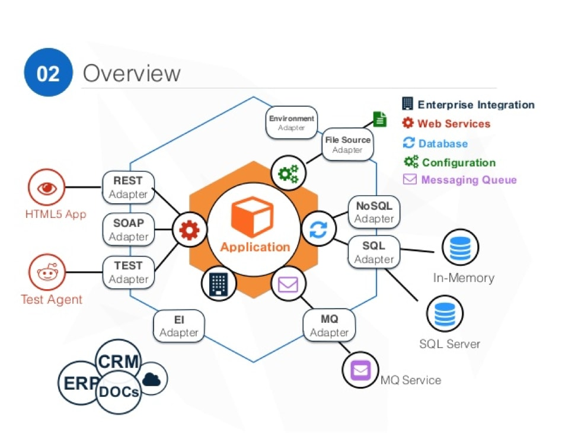

六边形架构（端口适配器）

简而言之，在六边形架构风格中，应用程序的内部（中间的橙色六边形）包含业务规则，基于业务规则的计算，领域对象，领域事件等。这部分是企业应用的核心：比如在线商店里什么样的商品可以打折，对那种类型的用户进行80%的折扣；取消一个正在执行的流水线会需要发生什么动作，删除一个已经被别的Job依赖的Stage又应该如何处理。

而外部的，也是我们平时最熟悉的诸如REST，SOAP，NoSQL，SQL，Message Queue等，都通过一个端口接入，然后在内外之间有一个适配器组成的层，它负责将不同端口来的数据进行转换，翻译成领域内部可以识别的概念（领域对象，领域事件等）。

内部不关心数据从何而来，不关心数据如何存储，不关心输出时JSON还是XML，事实上它对调用者一无所知，它可以处理的数据已经是经过适配器转换过的领域对象了。

## 六边形架构的优点

* 业务领域的边界更加清晰
* 更好的可扩展性
* 对测试的友好支持
* 更容易实施DDD(Domain Driven Design)

要新添加一种数据库的支持，或者需要将RESTful的应用扩展为支持SOAP，我们只需要定义一组端口-适配器即可，对于业务逻辑部分无需触碰，而且对既有的端口-适配器也不会有影响。

由于业务之外的一切都属于外围，所以应用程序是真的跑在了Web容器中还是一个Java进程中其实是无所谓的，这时候自动化测试会容易很多，因为测试的重点：业务逻辑和复杂的计算都是简单对象，也无需容器，数据库之类的环境问题，单元级别的测试就可以覆盖大部分的业务场景。

这种架构模式甚至可能影响到团队的组成，对业务有深入理解的业务专家和技术专家一起来完成核心业务领域的建模及编码，而外围的则可以交给新人或者干脆外包出去。

在很多情况下，从开发者的角度进行的假设都会在事后被证明是错误的。人们在预测软件未来演进方向时往往会做很多错误的决定。比如对关系型数据库的选用，对前端框架的选用，对中间件的选用等等，六边形架构可以很好的帮助我们避免这一点。

参考资料

* [解读六边形架构](http://www.jianshu.com/p/c6bb08d9c613)
* [微服务实战（一）：微服务架构的优势与不足](http://dockone.io/article/394)
* [六边形架构模式](https://my.oschina.net/xuemingdeng/blog/731913)
* [从三明治到六边形](http://insights.thoughtworkers.org/from-sandwich-to-hexagon/)