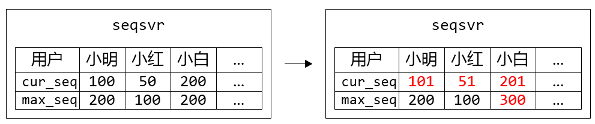
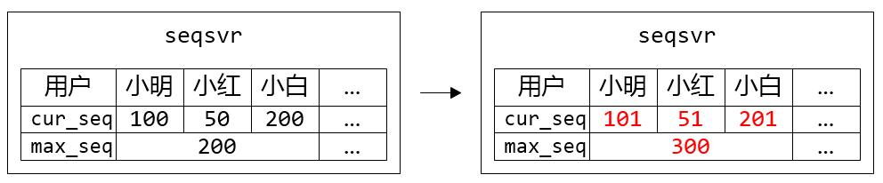
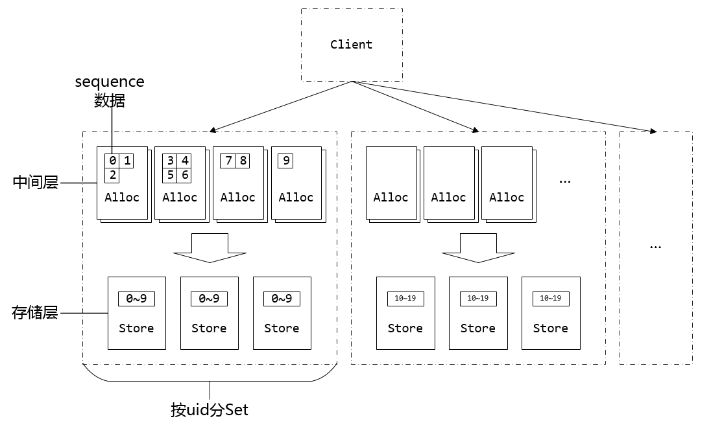
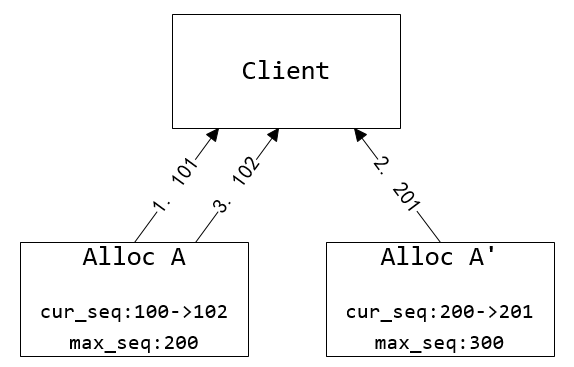
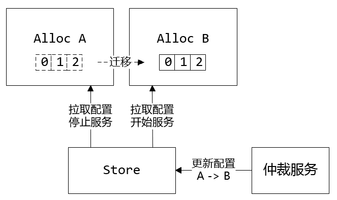
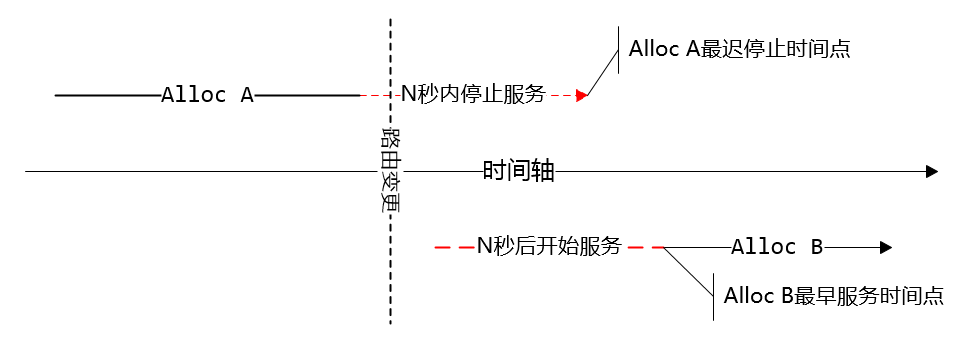
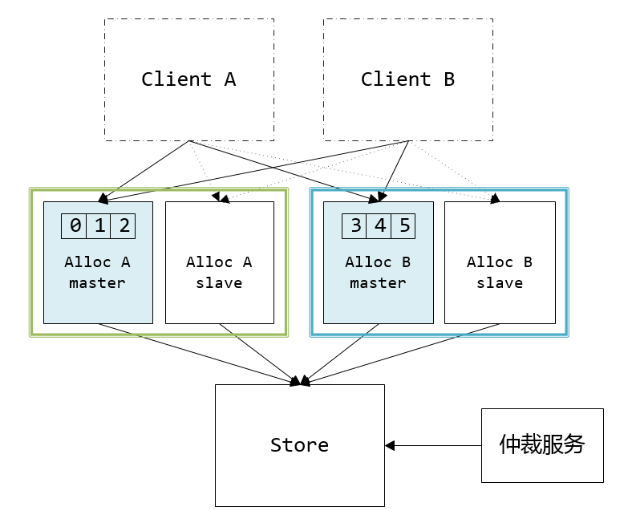
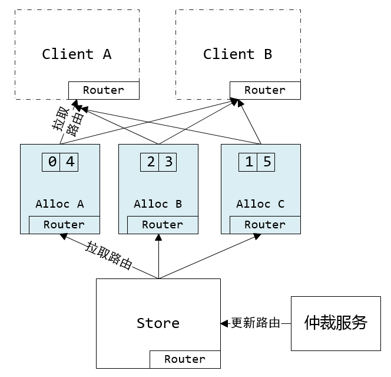
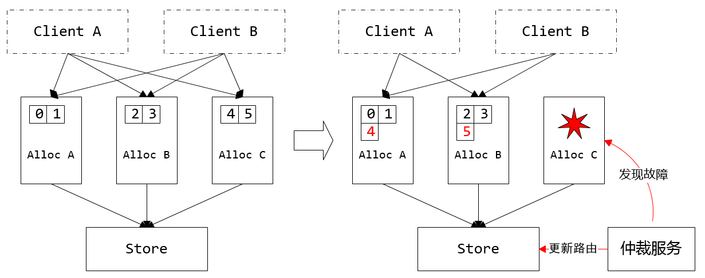

本文出处：

利用数据版本号实现数据增量同步机制
<http://www.infoq.com/cn/articles/wechat-serial-number-generator-architecture>

作者：
曾钦松，微信高级工程师，目前负责微信后台基础服务、朋友圈后台等开发优化，致力于高可用高性能后台系统的设计与研发。2011年毕业于西安电子科技大学，早先曾在腾讯搜搜从事检索架构、分布式数据库方面的工作。 

微信为每个帐号维护一个唯一的、递增的序列号（sequence），作为这份数据的版本号。

后台会根据客户端最大版本号与服务器端的最大版本号，计算出需要同步的增量数据，返回给客户端。
这样不仅保证了客户端与服务器端的数据同步的可靠性，同时也大幅减少了同步时的冗余数据。

## 独立开发 seqsvr 服务的原因：

1. 业务有 *大量的* sequence查询需求——查询已经分配出去的最后一个sequence
而基于seqsvr的查询操作可以做到非常轻量级，避免对存储层的大量IO查询操作；

2. 微信用户的不同种类的数据存在不同的Key-Value系统中，使用统一的序列号有助于*避免重复开发*，
同时业务逻辑可以很方便地判断一个用户的各类数据是否有更新。

## 架构原型

从seqsvr申请的、用作数据版本号的sequence，具有两种基本的性质：

1. 递增的64位整型变量.    
	max 2^63-1=9.22E18     
	min -2^63     
	每个8bytes大小   
2. 每个用户都有自己独立的64位sequence空间

### 预分配中间层

按照目前每秒千万级的访问量（~10^7 QPS），*每次加一后数据的硬盘存储要求* 是任何硬盘系统都无法扛住的。

业务上 只要求递增，并没有要求连续。

所以硬盘上只存一个分段的max值，实际的在内存中。

这样通过增加一个预分配sequence的中间层，在保证sequence不回退的前提下，大幅地提升了分配sequence的性能（减少IO操作）。

实际应用中每次提升的步长为10000，那么持久化的硬盘IO次数从之前~10^7 QPS 降低到~10^3 QPS，处于可接受范围。

在正常运作时分配出去的sequence是顺序递增的，只有在机器重启后，第一次分配的sequence会产生一个比较大的跳跃，跳跃大小取决于步长大小。

### 分号段共享存储

请求带来的硬盘IO问题解决了，可以支持服务平稳运行，
但该模型还是存在一个问题：*重启时要读取大量的max_seq数据加载到内存中。*

分号段共享存储的原因：

1. uid（用户唯一ID）上限2^32个、一个 max_seq 8bytes的空间，数据大小一共为32GB，从硬盘加载需要不少时间。

2^32*8bytes =2^35bytes =2^25KB =2^15MB =2^5GB =32GB

2. 出于数据可靠性的考虑，必然需要一个可靠存储系统来保存max_seq数据，重启时通过网络从该可靠存储系统加载数据。如果max_seq数据过大的话，会导致重启时在数据传输花费大量时间，造成一段时间不可服务。

为了解决这个问题，我们引入号段Section的概念，uid相邻的一段用户属于一个号段，而同个号段内的用户共享一个max_seq，这样大幅减少了max_seq数据的大小，同时也降低了IO次数。

目前seqsvr一个Section包含10万个uid，max_seq数据只有300+KB，为我们实现从可靠存储系统读取max_seq数据重启打下基础。

每台服务器IO存储的大小：
2^35bytes /100000 =2^25KB /100000 = 335.53KB

### 工程实现

工程实现在上面两个策略上做了一些调整，主要是出于数据可靠性及灾难隔离考虑

1. 把存储层和缓存中间层分成两个模块StoreSvr及AllocSvr。   
	* StoreSvr为存储层，利用了多机NRW策略来保证数据持久化后不丢失；   
	* AllocSvr则是缓存中间层，部署于多台机器，每台AllocSvr负责若干号段的sequence分配，分摊海量的sequence申请请求。

2. 整个系统又按uid范围进行分Set，每个Set都是一个完整的、独立的StoreSvr+AllocSvr子系统。    
   分Set设计目的是为了做*灾难隔离*，一个Set出现故障只会影响该Set内的用户，而不会影响到其它用户。

## 容灾设计 

### seqsvr架构设计原则
seqsvr是一个与整个微信服务端正常运行息息相关的模块,可靠性是它最基本的要求。

seqsvr的容灾模型在五年中进行过一次比较大的重构，提升了可用性、机器利用率等方面。其中不管是重构前还是重构后的架构，seqsvr一直遵循着两条架构设计原则：

1. 保持自身架构简单
2. 避免对外部模块的强依赖

seqsvr最核心的点是什么呢？   
每个uid的sequence申请要递增不回退。

如果seqsvr满足这么一个约束：任意时刻任意uid有且仅有一台AllocSvr提供服务，就可以比较容易地实现sequence递增不回退的要求。

### 单实例的故障转移

由于这个约束，多台AllocSvr同时服务同一个号段的多主机模型在这里就不适用了。我们只能采用单点服务的模式，当某台AllocSvr发生服务不可用时，将该机服务的uid段切换到其它机器来实现容灾。

这里需要引入一个仲裁服务，探测AllocSvr的服务状态，决定每个uid段由哪台AllocSvr加载。出于可靠性的考虑，仲裁模块并不直接操作AllocSvr，而是将加载配置写到StoreSvr持久化，然后AllocSvr定期访问StoreSvr读取最新的加载配置，决定自己的加载状态。

同时，为了避免失联AllocSvr提供错误的服务，返回脏数据，AllocSvr需要跟StoreSvr保持租约。这个租约机制由以下两个条件组成：

1. 租约失效：AllocSvr N秒内无法从StoreSvr读取加载配置时，AllocSvr停止服务
2. 租约生效：AllocSvr读取到新的加载配置后，立即卸载需要卸载的号段，需要加载的新号段等待N秒后提供服务

这两个条件保证了切换时，新AllocSvr肯定在旧AllocSvr下线后才开始提供服务。但这种租约机制也会造成切换的号段存在小段时间的不可服务，不过由于微信后台逻辑层存在*重试机制及异步重试队列*，小段时间的不可服务是用户无感知的，而且出现租约失效、切换是小概率事件，整体上是可以接受的。

## 容灾1.0架构：主备容灾

最初版本的seqsvr采用了*主机+冷备机容灾模式*：全量的uid空间均匀分成N个Section，连续的若干个Section组成了一个Set，每个Set都有一主一备两台AllocSvr。正常情况下只有主机提供服务；在主机出故障时，仲裁服务切换主备，原来的主机下线变成备机，原备机变成主机后加载uid号段提供服务。

主备容灾存在一些明显的缺陷:

1. 备机闲置导致有一半的空闲机器;
2. 主备切换的时候，备机在瞬间要接受主机所有的请求，容易导致备机过载。

最初选择的原因：

1. 架构简单，可以快速开发
2. 机器数少，机器冗余不是主要问题
3. Client端更新AllocSvr的路由状态很容易实现

前两点好懂，人力、机器都不如时间宝贵。

第三点：

微信后台绝大部分模块使用了一个*自研的RPC框架*，seqsvr也不例外。在这个RPC框架里，调用端读取本地机器的client配置文件，决定去哪台服务端调用。

这种模型对于无状态的服务端，是很好用的，也很方便实现容灾。我们可以在client配置文件里面写“对于号段x，可以去SvrA、SvrB、SvrC三台机器的任意一台访问”，实现三主机容灾。

基于这个RPC框架的配置中心， 采用主备容灾模型，*最多也只会浪费一次的试探请求来确定AllocSvr的服务状态*，额外消耗少，编码也简单。可是，如果Svr端采用了其它复杂的容灾策略，那么基于静态配置的框架就很难去确定Svr端的服务状态：Svr发生状态变更，Client端无法确定应该向哪台Svr发起请求。这也是为什么一开始选择了主备容灾的原因之一。

实际运营中，容灾1.0架构存在两个重大的不足：

1. 扩容、缩容非常麻烦
2. 一个Set的主备机都过载，无法使用其他Set的机器进行容灾

对于第二个问题，常见的方法是用一致性Hash算法替代主备，一个Set有多台机器，过载机器的请求被分摊到多台机器，容灾效果会更好。在seqsvr中使用类似一致性Hash的容灾策略也是可行的，只要Client端与仲裁服务都使用完全一样的一致性Hash算法，这样Client端可以启发式地去尝试，直到找到正确的AllocSvr。例如对于某个uid，仲裁服务会优先把它分配到AllocSvrA，如果AllocSvrA挂掉则分配到AllocSvrB，再不行分配到AllocSvrC。那么Client在访问AllocSvr时，按照AllocSvrA -> AllocSvrB -> AllocSvrC的顺序去访问，也能实现容灾的目的。但这种方法仍然没有克服前面主备容灾面临的配置文件变更的问题，运营起来也很麻烦。

## 容灾2.0架构：嵌入式路由表容灾

最后我们另辟蹊径，采用了一种不同的思路：既然Client端与AllocSvr存在路由状态不一致的问题，那么让AllocSvr把当前的路由状态传递给Client端，打破之前只能根据本地Client配置文件做路由决策的限制，从根本上解决这个问题。

在2.0架构中，我们把AllocSvr的路由状态嵌入到Client请求sequence的响应包中，在不带来额外的资源消耗的情况下，实现了Client端与AllocSvr之间的路由状态一致。具体实现方案如下：

seqsvr所有模块使用了统一的路由表，描述了uid号段到AllocSvr的全映射。这份路由表由仲裁服务根据AllocSvr的服务状态生成，写到StoreSvr中，由AllocSvr当作租约读出，最后在业务返回包里旁路给Client端。

把路由表嵌入到请求响应包看似很简单的架构变动，却是整个seqsvr容灾架构的技术奇点。利用它解决了路由状态不一致的问题后，可以实现一些以前不容易实现的特性。例如灵活的容灾策略，让所有机器都互为备机，在机器故障时，把故障机上的号段均匀地迁移到其它可用的AllocSvr上；还可以根据AllocSvr的负载情况，进行负载均衡，有效缓解AllocSvr请求不均的问题，大幅提升机器使用率。

另外在运营上也得到了大幅简化。之前对机器进行运维操作有着繁杂的操作步骤，而新架构只需要更新路由即可轻松实现上线、下线、替换机器，不需要关心配置文件不一致的问题，避免了一些由于人工误操作引发的故障。

#### 路由同步优化

把路由表嵌入到取sequence的请求响应包中，那么会引入一个类似“先有鸡还是先有蛋”的哲学命题：没有路由表，怎么知道去哪台AllocSvr取路由表？另外，取sequence是一个超高频的请求，如何避免嵌入路由表带来的带宽消耗？

这里通过在Client端内存缓存路由表以及路由版本号来解决，请求步骤如下：

1. Client根据本地共享内存缓存的路由表，选择对应的AllocSvr；
	如果路由表不存在，随机选择一台AllocSvr
	
2. 对选中的AllocSvr发起请求，请求带上本地路由表的版本号

3. AllocSvr收到请求，除了处理sequence逻辑外，
	*判断Client带上版本号是否最新，如果是旧版则在响应包中附上最新的路由表 *

4. Client收到响应包，除了处理sequence逻辑外，判断响应包是否带有新路由表。如果有，更新本地路由表，并决策是否返回第1步重试

基于以上的请求步骤，在本地路由表失效的时候，使用少量的重试便可以拉到正确的路由，正常提供服务。

部署情况：
每天万亿级调用的重量级系统，每次申请序列号平时调用耗时1ms，99.9%的调用耗时小于3ms，服务部署于数百台4核CPU服务器上！ 