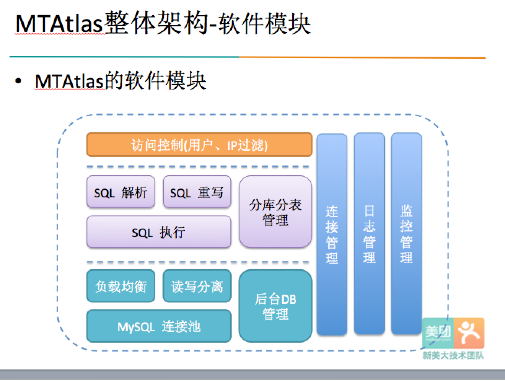
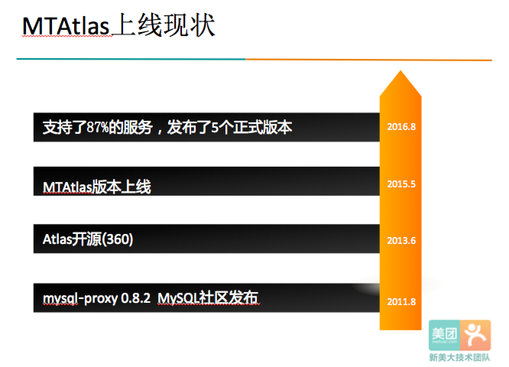
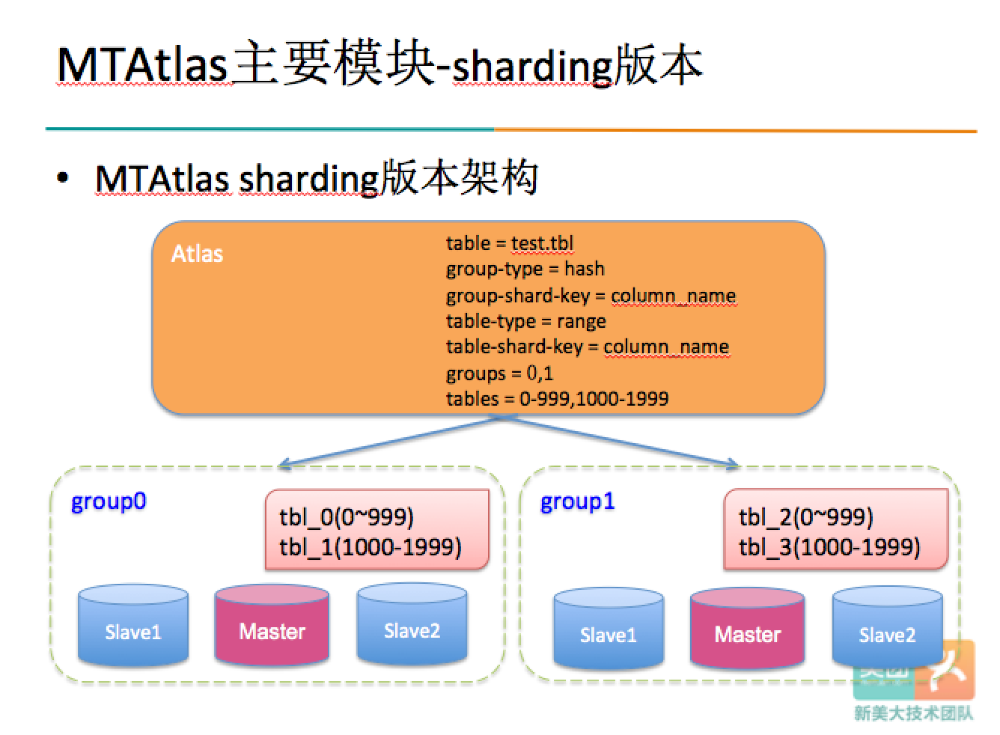

美团点评的Atlas实践

出处： <http://tech.meituan.com/atlas-introduction.html>

作者：
平仲，美团点评高级DBA，现负责美团点评数据库中间件Atlas的开发；主要工作经历从事于数据库内核及中间件开发。

Atlas是由 Qihoo 360,  Web平台部基础架构团队开发维护的一个基于MySQL协议的数据中间层项目。它在MySQL官方推出的MySQL-Proxy 0.8.2版本的基础上，修改了大量bug，添加了很多功能特性。
<http://www.oschina.net/p/atlas>

主要功能：

* 读写分离
* 从库负载均衡
* IP过滤
* SQL语句黑白名单
* 自动分表

Q & A
-------------------
Q: 是否支持多字符集？
A: 这是我们对原版MySQL-Proxy的第一项改进，符合国情是必须的

Q: 自动读写分离挺好，但有时候我写完马上就想读，万一主从同步延迟怎么办?
A: SQL语句前增加 /*master*/ 就可以将读请求强制发往主库

Q: 主库宕机，读操作受影响么？
A: 在atlas中是不会的! 能问这样的问题, 说明你用过官方的mysql-proxy, 很遗憾官方版本并未解决这个问题

Q: 检测后端DB状态会阻塞正常请求么？
A: 不会, atlas中检测线程是异步进行检测的，即使有db宕机，也不会阻塞主流程。在atlas中没有什么异常会让主流程阻塞! 同上，官方版本也会让你失望

Q: 想下线一台DB, 又不想停掉mysql server, 怎么办？
A: 可以通过管理接口手动上下线后端db, atlas会优先考虑管理员的意愿

Q: 想给集群中增加一台DB, 不想影响线上正常访问可以吗？
A: 通过管理接口可以轻松实现

Q: 相比官方mysql-proxy, atlas还有哪些改进？
A: 这实在是个难以回答的问题，性能，稳定性，可靠性，易维护性，我们做过几十项的改进，下面会尽量列一些较大的改动

VS 官方MySQL-Proxy
 -------------------
1. 将主流程中所有Lua代码改为纯C实现，Lua仅用在管理接口
2. 重写网络模型、线程模型
3. 实现了真正意义的连接池
4. 优化了锁机制，性能提高数十倍
5. ......

附名字来源：
    Atlas，希腊神话中双肩撑天的巨人，普罗米修斯的兄弟，最高大强壮的神之一，因反抗宙斯失败而被罚顶天。我们期望这个系统能够脚踏后端DB，为前端应用撑起一片天。
    
    
美团的 Atlas 架构

美团 MTAtlas 上线情况

美团 MTAtlas 分库分表支持情况

