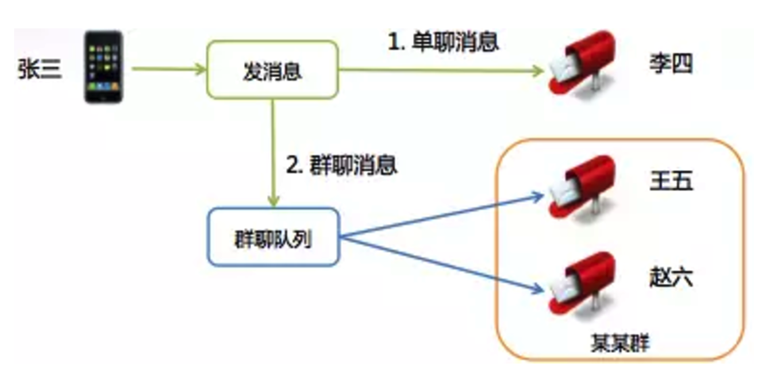
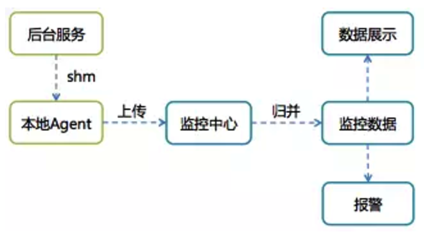
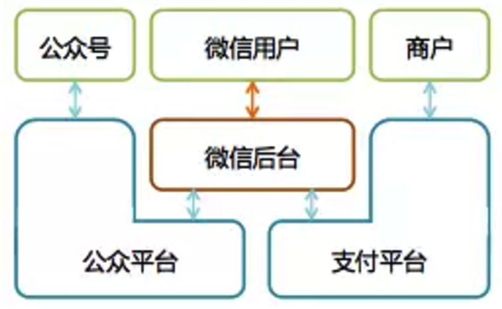
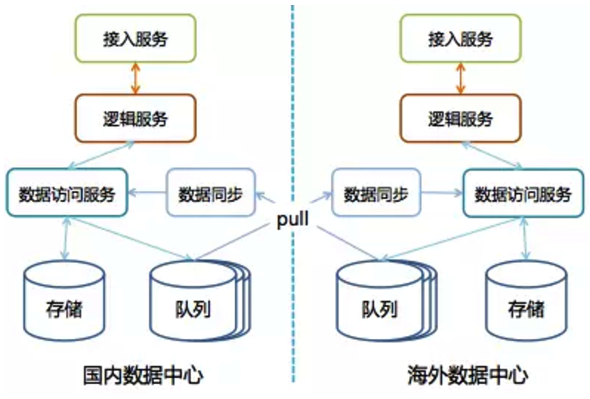
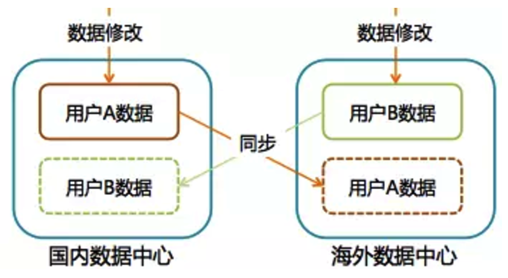

# 微信后台演进

出处：   

* [从无到有：微信后台系统的演进之路](http://www.infoq.com/cn/articles/the-road-of-the-growth-weixin-background)
* [从0到1：微信后台系统的演进之路](http://36kr.com/p/5042290.html)

作者： 张文瑞

微信高级工程师，微信接入系统负责人

一直从事后台系统设计开发，早期涉足传统行业软件，后投身互联网。作为微信最早的后台开发之一，见证了微信从零开始到逐渐发展壮大的过程。

## 1、 从无到有  (2个月，2011.1.21之前)

2011.1.21 微信正式发布。这一天距离微信项目启动日约为2个月。

### 1.1、确定了微信的消息模型

微信起初定位是一个通讯工具, 最核心的功能是收发消息.

微信团队源于广硏团队，消息模型跟邮箱的邮件模型也很有渊源，都是存储转发。

      
图(1) 微信消息模型

* 消息被发出后，会先在后台临时存储；
* 为使接收者能更快接收到消息，会推送消息通知给接收者；
* 最后客户端主动到服务器收取消息。

### 1.2、制定了数据同步协议
用户的帐户、联系人和消息等数据都在服务器存储，如何将数据同步到客户端？ 

细节参考： [序列号生成算法](../../序列号生成算法/wechat-serial-number-generator-architecture.md)

为简化协议，通过一个统一的数据同步协议来同步用户所有的数据。

#### 1.2.1、最初的方案

1. 客户端记录一个本地数据的快照(Snapshot)
2. 需要同步数据时，将Snapshot带到服务器
3. 服务器通过计算Snapshot与服务器数据的差异，将差异数据发给客户端
4. 客户端再保存差异数据完成同步。

这套方案的问题：

* Snapshot会随着客户端数据的增多变得越来越大，同步时流量开销大；
* 客户端每次同步都要计算Snapshot，会带来额外的性能开销和实现复杂度。

#### 1.2.2 进化的方案
几经讨论后，方案改为:

1. 由服务计算Snapshot，
2. 在客户端同步数据时跟随数据一起下发给客户端，
3. 客户端无需理解Snapshot，只需存储起来，
4. 在下次数据同步数据时带上即可。

即    

* 服务器端会有一个算法知道目前同步的情况， 
* 客户端只要把完成同步后服务器最新给的Snapshot再次带上即可，而不用管它是哪种格式，哪种算法产生的。

Snapshot被设计得非常精简

* 是若干个Key-Value的组合，
* Key代表数据的类型，
* Value代表给到客户端的数据的最新版本号。
* Key有三个，分别代表：帐户数据、联系人和消息。

这个同步协议好处：

* 客户端同步完数据后，不需要额外的ACK协议来确认数据收取成功，同样可以保证不会丢数据：
* 只要客户端拿最新的Snapshot到服务器做数据同步，服务器即可确认上次数据已经成功同步完成，可以执行后续操作，例如清除暂存在服务的消息等等。

#### 1.2.3、过程中形成的指导原则：

* 精简方案、
* 减少流量开销、
* 尽量由服务器完成较复杂的业务逻辑、
* 降低客户端实现的复杂度

案例：

在微信1.2版实现了群聊功能，但为了保证新旧版客户端间的群聊体验，我们通过服务器适配，让1.0版客户端也能参与群聊。

### 1.3、 定型了后台架构

#### 1.3.1、微信后台使用三层架构：
接入层、逻辑层和存储层。

      
图(2) 微信后台系统架构

##### 1.3.1.1 接入层
接入层提供接入服务，包括长连接入服务和短连接入服务。

* 长连接入服务同时支持客户端主动发起请求和服务器主动发起推送；
* 短连接入服务则只支持客户端主动发起请求。

##### 1.3.1.2 逻辑层
逻辑层包括业务逻辑服务和基础逻辑服务。

+ 业务逻辑服务封装了业务逻辑，是后台提供给微信客户端调用的API。
+ 基础逻辑服务则抽象了更底层和通用的业务逻辑，提供给业务逻辑服务访问。

##### 1.3.1.3 存储层
存储层包括数据访问服务和数据存储服务。

+ 数据存储服务通过MySQL和SDB(广硏早期后台中广泛使用的Key-Table数据存储系统)等底层存储系统来持久化用户数据。
+ 数据访问服务适配并路由数据访问请求到不同的底层数据存储服务，面向逻辑层提供结构化的数据服务。

比较特别的是，微信后台每一种不同类型的数据都使用单独的数据访问服务和数据存储服务，例如帐户、消息和联系人等等都是独立的。

#### 1.3.2、 Svrkit RPC 框架

微信后台主要使用C++。后台服务使用Svrkit框架搭建，服务之间通过同步RPC进行通讯。

       
图(3) Svrkit 框架

Svrkit是另一个广硏后台就已经存在的高性能RPC框架，当时尚未广泛使用，但在微信后台却大放异彩。

作为微信后台基础设施中最重要的一部分，Svrkit这几年一直不断在进化。

使用Svrkit构建了数以千计的服务模块，提供数万个服务接口，每天RPC调用次数达几十万亿次。

### 1.4、 运营支撑系统

有一个经验教训——运营支撑系统真的很重要。

第一个版本的微信后台是仓促完成的，当时只是完成了基础业务功能，并没有配套的业务数据统计等等。

我们在开放注册后，一时间竟没有业务监控页面和数据曲线可以看，注册用户数是临时从数据库统计的，在线数是从日志里提取出来的，这些数据通过每个小时运行一次的脚本（这个脚本也是当天临时加的）统计出来，然后自动发邮件到邮件组。

还有其他各种业务数据也通过邮件进行发布，可以说邮件是微信初期最重要的数据门户。

2011.1.21 当天最高并发在线数是 491，而今天这个数字是4亿。

## 2、 小步慢跑 （4个月，2011.8之前）

在微信发布后的4个多月里，我们经历了发布后火爆注册的惊喜，也经历了随后一直不温不火的困惑。

### 2.1、功能快速补充

这一时期，微信做了很多旨在增加用户好友量，让用户聊得起来的功能。

* 打通腾讯微博私信、
* 群聊、
* 工作邮箱、
* QQ/邮箱好友推荐等等。

对于后台而言，比较重要的变化就是这些功能催生了对异步队列的需求:

* 微博私信需要跟外部门对接，不同系统间的处理耗时和速度不一样，可以通过队列进行缓冲；
* 群聊是耗时操作，消息发到群后，可以通过异步队列来异步完成消息的扩散写等等。

        
图(4) 单聊和群聊消息发送过程

图4是异步队列在群聊中的应用。异步队列作为后台数据交互的一种重要模式，成为了同步RPC服务调用之外的有力补充，在微信后台被大量使用。

### 2.2、 群聊 写扩散

微信的群聊是写扩散的，也就是说发到群里的一条消息会给群里的每个人都存一份（消息索引）。为什么不是读扩散呢？有两个原因：

* 群的人数不多，群人数上限是10（后来逐步加到20、40、100，目前是500），扩散的成本不是太大，不像微博，有成千上万的粉丝，发一条微博后，每粉丝都存一份的话，一个是效率太低，另一个存储量也会大很多；
* 消息扩散写到每个人的消息存储（消息收件箱）后，接收者到后台同步数据时，只需要检查自己收件箱即可，同步逻辑跟单聊消息是一致的，这样可以统一数据同步流程，实现起来也会很轻量。

## 3、 快速成长 (2011.5.10-2011.10.1 2.0的生命周期)

微信的飞速发展是从*2.0版*开始的，这个版本发布了语音聊天功能。之后微信用户量急速增长。     
2011年5月10日，微信发布了2.0版本

* 2011.5用户量破100万、
* 2011.7 用户量破1000万、
* 2012.3 注册用户数突破1亿。

### 3.1、业务快速发展期的烦恼：

#### 3.1.1、 业务快速迭代的压力

* 微信发布时功能很简单，主要功能就是发消息。不过在发语音之后的几个版本里迅速推出了
	* 手机通讯录、
	* QQ离线消息、
	* 查看附近的人、
	* 摇一摇、
	* 漂流瓶
	* 朋友圈 等等功能。

* 有个广为流传的关于朋友圈开发的传奇——朋友圈历经4个月，前后做了30多个版本迭代才最终成型。
* 其实还有一个鲜为人知的故事——那时候因为人员比较短缺，朋友圈后台长时间只有1位开发人员。

		
	
#### 3.1.2、后台稳定性的要求

* 用户多了，功能也多了，后台模块数和机器量在不断翻番，紧跟着的还有各种故障。

帮助顺利度过这个阶段的，是以下几个举措：

### 3.2、 极简设计

实现需求最大的困难不是设计出一个方案并实现出来，而是需要在若干个可能的方案中，甄选出*最简单实用的*那个。

这中间往往需要经过几轮思考——讨论——推翻的迭代过程，谋定而后动有不少好处，

* 一方面可以避免做出华而不实的过度设计，提升效率；
* 另一方面，通过详尽的讨论出来的看似简单的方案，细节考究，往往是可靠性最好的方案。

### 3.3、 大系统小做

逻辑层的业务逻辑服务最早只有一个服务模块（我们称之为mmweb），囊括了所有提供给客户端访问的API，甚至还有一个完整的微信官网。

这个模块架构类似Apache，由一个CGI容器（CGIHost）和若干CGI组成（每个CGI即为一个API），不同之处在于每个CGI都是一个动态库so，由CGIHost动态加载。

在mmweb的CGI数量相对较少的时候，这个模块的架构完全能满足要求，但当功能迭代加快，CGI量不断增多之后，开始出现问题：

1. 每个CGI都是动态库，在某些CGI的共用逻辑的接口定义发生变化时，不同时期更新上线的CGI可能使用了不同版本的逻辑接口定义，会导致在运行时出现诡异结果或者进程crash，而且非常*难以定位*；

2. 所有CGI放在一起，每次大版本发布上线，从测试到灰度再到全面部署完毕，都是一个很*漫长*的过程，几乎所有后台开发人员都会被同时卡在这个环节，非常影响效率；

3. 新增的不太重要的CGI有时稳定性不好，某些异常分支下会crash，导致CGIHost进程无法服务，发消息这些重要CGI受影响没法运行。

于是我们开始尝试使用一种新的CGI架构——Logicsvr。

Logicsvr基于Svrkit框架。

将Svrkit框架和CGI逻辑通过静态编译生成可直接使用HTTP访问的Logicsvr。

我们将mmweb模块拆分为8个不同服务模块。

拆分原则是：

* 实现不同业务功能的CGI被拆到不同Logicsvr，
* 同一功能但是重要程度不一样的也进行拆分。
	* 例如，作为核心功能的消息收发逻辑，就被拆为3个服务模块：
		* 消息同步、
		* 发文本和语音消息、
		* 发图片和视频消息。

每个Logicsvr都是一个独立的二进制程序，可以分开部署、独立上线。

时至今日，微信后台有数十个Logicsvr，提供了数百个CGI服务，部署在数千台服务器上，每日客户端访问量几千亿次。

除了API服务外，其他后台服务模块也遵循“大系统小做”这一实践准则，微信后台服务模块数从微信发布时的约10个模块，迅速上涨到数百个模块。

### 3.4、 业务监控

这一时期，后台故障很多。比故障更麻烦的是，因为监控的缺失，经常有些故障我们没法第一时间发现，造成故障影响面被放大。

监控的缺失

* 一方面是因为在快速迭代过程中，重视功能开发，轻视了业务监控的重要性，有故障一直是兵来将挡水来土掩；
* 另一方面是基础设施对业务逻辑监控的支持度较弱。基础设施提供了机器资源监控和Svrkit服务运行状态的监控。这个是每台机器、每个服务标配的，无需额外开发，但是业务逻辑的监控就要麻烦得多了。

业务逻辑监控是通过业务逻辑统计功能来做的，实现一个监控需要4步：

1. 申请日志上报资源；
2. 在业务逻辑中加入日志上报点，日志会被每台机器上的agent收集并上传到统计中心；
3. 开发统计代码；
4. 实现统计监控页面。

这种费时费力的模式会反过来降低开发人员对加入业务监控的积极性。

去公司内的标杆——即通后台（QQ后台）取经,发现解决方案出乎意料地简单且强大:

#### 3.4.1、 故障报告

之前每次故障后，是由QA牵头出一份故障报告，着重点是对故障影响的评估和故障定级。

新的做法是每个故障不分大小，开发人员需要彻底复盘故障过程，然后商定解决方案，补充出一份详细的技术报告。

这份报告侧重于：

* 如何避免同类型故障再次发生、
* 提高故障主动发现能力、
* 缩短故障响应和处理过程。

#### 3.4.2、 基于 ID-Value 的业务无关的监控告警体系

      
图(5) 基于 ID-Value 的监控告警体系

监控体系实现思路非常简单，提供了2个API，

* 允许业务代码在共享内存中对某个监控ID进行设置Value
* 或累加Value的功能。

每台机器上的Agent会定时将所有ID-Value上报到监控中心，监控中心对数据汇总入库后就可以通过统一的监控页面输出监控曲线，并通过预先配置的监控规则产生报警。

对于业务代码来说，只需在要被监控的业务流程中调用一下监控API，并配置好告警条件即可。

这就极大地降低了开发监控报警的成本，我们补全了各种监控项，让我们能主动及时地发现问题。

新开发的功能也会预先加入相关监控项，以便在少量灰度阶段就能直接通过监控曲线了解业务是否符合预期。

### 3.5、 KVSvr

微信后台每个存储服务都有自己独立的存储模块，是相互独立的。每个存储服务都有一个业务访问模块和一个底层存储模块组成。

业务访问层隔离业务逻辑层和底层存储，提供基于RPC的数据访问接口；

底层存储有两类：SDB和MySQL。

SDB适用于以用户UIN(uint32_t)为Key的数据存储，比方说消息索引和联系人。

优点是性能高，在可靠性上，提供基于异步流水同步的Master-Slave模式，Master故障时，Slave可以提供读数据服务，无法写入新数据。

由于微信账号为字母+数字组合，无法直接作为SDB的Key，所以微信帐号数据并非使用SDB，而是用MySQL存储的。

MySQL也使用基于异步流水复制的Master-Slave模式。

#### 第1版的帐号存储服务使用Master-Slave各1台。

Master提供读写功能，Slave不提供服务，仅用于备份。

当Master有故障时，人工切读服务到Slave，无法提供写服务。

为提升访问效率，我们还在业务访问模块中加入了memcached提供Cache服务，减少对底层存储访问。

#### 第2版的帐号存储服务还是Master-Slave各1台，区别是Slave可以提供读服务，

但有可能读到脏数据，因此对一致性要求高的业务逻辑，例如注册和登录逻辑只允许访问Master。当Master有故障时，同样只能提供读服务，无法提供写服务。

#### 第3版的帐号存储服务采用1个Master和多个Slave，解决了读服务的水平扩展能力。

#### 第4版的帐号服务底层存储采用多个Master-Slave组，

每组由1个Master和多个Slave组成，解决了写服务能力不足时的水平扩展能力。

最后还有个未解决的问题：单个Master-Slave分组中，Master还是单点，无法提供实时的写容灾，也就意味着无法消除单点故障。

另外Master-Slave的流水同步延时对读服务有很大影响，流水出现较大延时会导致业务故障。

于是我们寻求一个可以提供高性能、具备读写水平扩展、没有单点故障、可同时具备读写容灾能力、能提供强一致性保证的底层存储解决方案，最终KVSvr应运而生。

KVSvr使用基于Quorum的分布式数据强一致性算法，提供Key-Value/Key-Table模型的存储服务。

传统Quorum算法的性能不高，KVSvr创造性地将数据的版本和数据本身做了区分，将Quorum算法应用到数据的版本的协商，再通过基于流水同步的异步数据复制提供了数据强一致性保证和极高的数据写入性能，另外KVSvr天然具备数据的Cache能力，可以提供高效的读取性能。

KVSvr一举解决了我们当时迫切需要的无单点故障的容灾能力。

除了第5版的帐号服务外，很快所有SDB底层存储模块和大部分MySQL底层存储模块都切换到KVSvr。随着业务的发展，KVSvr也不断在进化着，还配合业务需要衍生出了各种定制版本。

现在的KVSvr仍然作为核心存储，发挥着举足轻重的作用。

## 4、 平台化 (2011.8-*)

### 4.1、 平台化的需求越来越多

#### 4.1.1、 微信深圳大运志愿者服务中心
2011.8 深圳举行大运会。微信推出“微信深圳大运志愿者服务中心”服务号，微信用户可以搜索“szdy”将这个服务号加为好友，获取大会相关的资讯。当时后台对“szdy”做了特殊处理，用户搜索时，会随机返回“szdy01”，“szdy02”，…，“szdy10”这10个微信号中的1个，每个微信号背后都有一个志愿者在服务。

#### 4.1.2、 微成都
2011.9 “微成都”落户微信平台，微信用户可以搜索“wechengdu”加好友，成都市民还可以在“附近的人”看到这个号，我们在后台给这个帐号做了一些特殊逻辑，可以支持后台自动回复用户发的消息。

这种需求越来越多，我们就开始做一个媒体平台，这个平台后来从微信后台分出，演变成了微信公众平台，独立发展壮大，开始了微信的平台化之路。

除微信公众平台外，微信后台的外围还陆续出现了微信支付平台、硬件平台等等一系列平台。

     
图(6) 微信平台

## 5、 走出国门 （2011.10.1-）

微信走出国门的尝试开始于3.0版本。从这个版本开始，微信逐步支持繁体、英文等多种语言文字。不过，真正标志性的事情是第一个海外数据中心的投入使用。

2011年10月1日，微信发布3.0版本，该版本加入了“摇一摇”和漂流瓶功能，增加了对繁体中文语言界面的支持，并增加港、澳、台、美、日五个地区的用户绑定手机号。

### 5.1、 海外数据中心

海外数据中心的定位是一个自治的系统，也就是说具备完整的功能，能够不依赖于国内数据中心独立运作。

#### 5.1.1、 多数据中心架构

系统自治对于无状态的接入层和逻辑层来说很简单，所有服务模块在海外数据中心部署一套就行了。

但是存储层就有很大麻烦了——我们需要确保国内数据中心和海外数据中心能独立运作，但不是两套隔离的系统各自部署，各玩各的，而是一套业务功能可以完全互通的系统。

因此我们的任务是需要保证两个数据中心的数据一致性，另外Master-Master架构是个必选项，也即两个数据中心都需要可写。

#### 5.1.2、 Master-Master 存储架构

Master-Master架构下数据的一致性是个很大的问题。

两个数据中心之间是个高延时的网络，意味着在数据中心之间直接使用Paxos算法、或直接部署基于Quorum的KVSvr等看似一劳永逸的方案不适用。

最终我们选择了跟Yahoo!的PNUTS系统类似的解决方案，需要对用户集合进行切分，

+ 国内用户以国内上海数据中心为Master，所有数据写操作必须回到国内数据中心完成；

+ 海外用户以海外数据中心为Master，写操作只能在海外数据中心进行。

从整体存储上看，这是一个Master-Master的架构，但细到一个具体用户的数据，则是Master-Slave模式，每条数据只能在用户归属的数据中心可写，再异步复制到其他数据中心。

#### 5.1.3、 数据中心间的数据一致性

这个Master-Master架构可以在不同数据中心间实现数据最终一致性。

如何保证业务逻辑在这种数据弱一致性保证下不会出现问题？

这个问题可以被分解为2个子问题：

##### 5.1.3.1、 用户访问自己的数据：

用户可以满世界跑，那是否允许用户就近接入数据中心就对业务处理流程有很大影响。
如果允许就近接入，同时还要保证数据一致性不影响业务，就意味着要么用户数据的Master需要可以动态的改变；要么需要对所有业务逻辑进行仔细梳理，严格区分本数据中心和跨数据中心用户的请求，将请求路由到正确的数据中心处理。

考虑到上述问题会带来很高昂的实现和维护的复杂度，我们限制了每个用户只能接入其归属数据中心进行操作。
如果用户发生漫游，其漫游到的数据中心会自动引导用户重新连回归属数据中心。

这样用户访问自己数据的一致性问题就迎刃而解了，因为所有操作被限制在归属数据中心内，其数据是有强一致性保证的。

此外，还有额外的好处：用户自己的数据（如：消息和联系人等）不需要在数据中心间同步，这就大大降低了对数据同步的带宽需求。

##### 5.1.3.2、 用户访问其他用户的数据：

由于不同数据中心之间业务需要互通，用户会使用到其他数据中心用户创建的数据。例如，参与其他数据中心用户创建的群聊，查看其他数据中心用户的朋友圈等。

仔细分析后可以发现，大部分场景下对数据一致性要求其实并不高。用户稍迟些才见到自己被加入某个其他数据中心用户建的群、稍迟些才见到某个好友的朋友圈动态更新其实并不会带来什么问题。在这些场景下，业务逻辑直接访问本数据中心的数据。

当然，还是有些场景对数据一致性要求很高。比方说给自己设置微信号，而微信号是需要在整个微信帐号体系里保证唯一的。我们提供了全局唯一的微信号申请服务来解决这一问题，所有数据中心通过这个服务申请微信号。这种需要特殊处置的场景极少，不会带来太大问题。

#### 5.1.4 、 可靠的数据同步

数据中心之间有大量的数据同步，数据是否能够达到最终一致，取决于数据同步是否可靠。

为保证数据同步的可靠性，提升同步的可用性，我们又开发一个基于Quorum算法的队列组件，这个组件的每一组由3机存储服务组成。

与一般队列的不同之处在于，这个组件对队列写入操作进行了大幅简化，3机存储服务不需要相互通讯，每个机器上的数据都是顺序写，执行写操作时在3机能写入成功2份即为写入成功；

若失败，则换另外一组再试。

因此这个队列可以达到极高的可用性和写入性能。

每个数据中心将需要同步的数据写入本数据中心的同步队列后，由其他数据中心的数据重放服务将数据拉走并进行重放，达到数据同步的目的。

### 5.2、 网络加速

海外数据中心建设周期长，投入大，微信只在香港和加拿大有两个海外数据中心。

但世界那么大，即便是这两个数据中心，也还是没法辐射全球，让各个角落的用户都能享受到畅快的服务体验。

通过在海外实际对比测试发现，微信客户端在发消息等一些主要使用场景与主要竞品有不小的差距。

为此，我们跟公司的架构平台部、网络平台部和国际业务部等兄弟部门一起合作，围绕海外数据中心，在世界各地精心选址建设了数十个POP点（包括信令加速点和图片CDN网络）。

另外，通过对移动网络的深入分析和研究，我们还对微信的通讯协议做了大幅优化。

微信最终在对比测试中赶上并超过了主要的竞品。

## 6、 精耕细作

### 6.1、 三园区容灾

2013.7.22 微信发生了有史以来最大规模的故障，消息收发和朋友圈等服务出现长达5个小时的故障，故障期间消息量跌了一半。

故障的起因是上海数据中心一个园区的主光纤被挖断，近2千台服务器不可用，引发整个上海数据中心（当时国内只有这一个数据中心）的服务瘫痪。

故障时，我们曾尝试把接入到故障园区的用户切走，但收效甚微。

虽然数百个在线模块都做了容灾和冗余设计，单个服务模块看起来没有单点故障问题；

但整体上看，无数个服务实例散布在数据中心各个机房的8千多台服务器内，各服务RPC调用复杂，呈网状结构，再加上缺乏系统级的规划和容灾验证，最终导致故障无法主动恢复。

在此之前，我们知道单个服务出现单机故障不影响系统，但没人知道2千台服务器同时不可用时，整个系统会出现什么不可控的状况。

其实在这个故障发生之前3个月，我们已经在着手解决这个问题。

当时上海数据中心内网交换机异常，导致微信出现一个出乎意料的故障，在13分钟的时间里，微信消息收发几乎完全不可用。

在对故障进行分析时，我们发现一个消息系统里一个核心模块三个互备的服务实例都部署在同一机房。

该机房的交换机故障导致这个服务整体不可用，进而消息跌零。

这个服务模块是最早期（那个时候微信后台规模小，大部分后台服务都部署在一个数据园区里）的核心模块，服务基于3机冗余设计，年复一年可靠地运行着，以至于大家都完全忽视了这个问题。

为解决类似问题，三园区容灾应运而生，目标是将上海数据中心的服务均匀部署到3个物理上隔离的数据园区，在任意单一园区整体故障时，微信仍能提供无损服务。

#### 6.1.1、 同时服务

传统的数据中心级灾备方案是“两地三中心”，即同城有两个互备的数据中心，异地再建设一个灾备中心，这三个数据中心平时很可能只有一个在提供在线服务，故障时再将业务流量切换到其他数据中心。

这里的主要问题是灾备数据中心无实际业务流量，在主数据中心故障时未必能正常切换到灾备中心，并且在平时大量的备份资源不提供服务，也会造成大量的资源浪费。

三园区容灾的核心是三个数据园区同时提供服务，因此即便某个园区整体故障，那另外两个园区的业务流量也只会各增加50%。

反过来说，只需让每个园区的服务器资源跑在容量上限的2/3，保留1/3的容量即可提供无损的容灾能力，而传统“两地三中心”则有多得多的服务器资源被闲置。

此外，在平时三个园区同时对外服务，因此我们在故障时，需要解决的问题是“怎样把业务流量切到其他数据园区？”，而不是“能不能把业务流量切到其他数据园区？”，前者显然是更容易解决的一个问题。

#### 6.1.2、 数据强一致

三园区容灾的关键是存储模块需要把数据均匀分布在3个数据园区，同一份数据要在不同园区有2个以上的一致的副本，这样才能保证任意单一园区出灾后，可以不中断地提供无损服务。

由于后台大部分存储模块都使用KVSvr，这样解决方案也相对简单高效——将KVSvr的每1组机器都均匀部署在3个园区里。

#### 6.1.3、 故障时自动切换

三园区容灾的另一个难点是对故障服务的自动屏蔽和自动切换。

即要让业务逻辑服务模块能准确识别出某些下游服务实例已经无法访问，然后迅速自动切到其他服务实例，避免被拖死。

我们希望每个业务逻辑服务可以在不借助外部辅助信息（如建设中心节点，由中心节点下发各个业务逻辑服务的健康状态）的情况下，能自行决策迅速屏蔽掉有问题的服务实例，自动把业务流量分散切到其他服务实例上。

另外，我们还建设了一套手工操作的全局屏蔽系统，可以在大型网络故障时，由人工介入屏蔽掉某个园区所有的机器，迅速将业务流量分散到其他两个数据园区。

#### 6.1.4、 容灾效果检验

三园区容灾是否能正常发挥作用还需要进行实际的检验，我们在上海数据中心和海外的香港数据中心完成三园区建设后，进行了数次实战演习，屏蔽单一园区上千台服务，检验容灾效果是否符合预期。

特别地，为了避免随着时间的推移某个核心服务模块因为某次更新就不再支持三园区容灾了，我们还搭建了一套容灾拨测系统，每天对所有服务模块选取某个园区的服务主动屏蔽掉，自动检查服务整体失败量是否发生变化，实现对三园区容灾效果的持续检验。

### 6.2、 性能优化

之前我们在业务迅速发展之时，优先支撑业务功能快速迭代，性能问题无暇兼顾，比较粗放的贯彻了“先扛住再优化”的海量之道。

2014年开始大幅缩减运营成本，性能优化就被提上了日程。

我们基本上对大部分服务模块的设计和实现都进行了重新review，并进行了有针对性的优化，这还是可以节约出不少机器资源的。

但更有效的优化措施是对基础设施的优化，具体的说是对Svrkit框架的优化。

Svrkit框架被广泛应用到几乎所有服务模块，如果框架层面能把机器资源使用到极致，那肯定是事半功倍的。

结果还真的可以，我们在基础设施里加入了对协程的支持，重点是这个协程组件可以不破坏原来的业务逻辑代码结构，让我们原有代码中使用同步RPC调用的代码不做任何修改，就可以直接通过协程异步化。

Svrkit框架直接集成了这个协程组件，然后美好的事情发生了，原来单实例最多提供上百并发请求处理能力的服务，在重编上线后，转眼间就能提供上千并发请求处理能力。

Svrkit框架的底层实现在这一时期也做了全新的实现，服务的处理能力大幅提高。

### 6.3、 防雪崩

我们一直以来都不太担心某个服务实例出现故障，导致这个实例完全无法提供服务的问题，这个在后台服务的容灾体系里可以被处理得很好。

最担心的是雪崩：某个服务因为某些原因出现过载，导致请求处理时间被大大拉长。

于是服务吞吐量下降，大量请求积压在服务的请求队列太长时间了，导致访问这个服务的上游服务出现超时。

更倒霉的是上游服务还经常会重试，然后这个过载的服务仅有的一点处理能力都在做无用功（即处理完毕返回结果时，调用端都已超时放弃），终于这个过载的服务彻底雪崩了。

最糟糕的情况是上游服务每个请求都耗时那么久，雪崩顺着RPC调用链一级级往上传播，最终单个服务模块的过载会引发大批服务模块的雪崩。

我们在一番勒紧裤腰带节省机器资源、消灭低负载机器后，所有机器的负载都上来了，服务过载变得经常发生了。

解决这一问题的有力武器是Svrkit框架里的具有QoS保障的FastReject机制，可以快速拒绝掉超过服务自身处理能力的请求，即使在过载时，也能稳定地提供有效输出。

### 6.4、 安全加固

近年，互联网安全事件时有发生，各种拖库层出不穷。为保护用户的隐私数据，我们建设了一套数据保护系统——全程票据系统。

其核心方案是，用户登录后，后台会下发一个票据给客户端，客户端每次请求带上票据，请求在后台服务的整个处理链条中，所有对核心数据服务的访问，都会被校验票据是否合法，非法请求会被拒绝，从而保障用户隐私数据只能用户通过自己的客户端发起操作来访问。

## 7、 新的挑战

### 7.1、 资源调度系统

微信后台有成千的服务模块，部署在全球数以万计的服务器上，一直依靠人工管理。

此外，微信后台主要是提供实时在线服务，每天的服务器资源占用在业务高峰和低谷时相差很大，在业务低谷时计算资源被白白浪费；另一方面，很多离线的大数据计算却受制于计算资源不足，难以高效完成。

我们正在实验和部署的资源调度系统（Yard）可以把机器资源的分配和服务的部署自动化、把离线任务的调度自动化，实现了资源的优化配置，在业务对服务资源的需求有变化时，能更及时、更弹性地自动实现服务的重新配置与部署。

### 7.2、 高可用存储

基于Quorum算法的KVSvr已经实现了强一致性、高可用且高性能的Key-Value/Key-Table存储。

最近，微信后台又诞生了基于Paxos算法的另一套存储系统，首先落地的是PhxSQL，一个支持完整MySQL功能，又同时具备强一致性、高可用和高性能的SQL存储。

