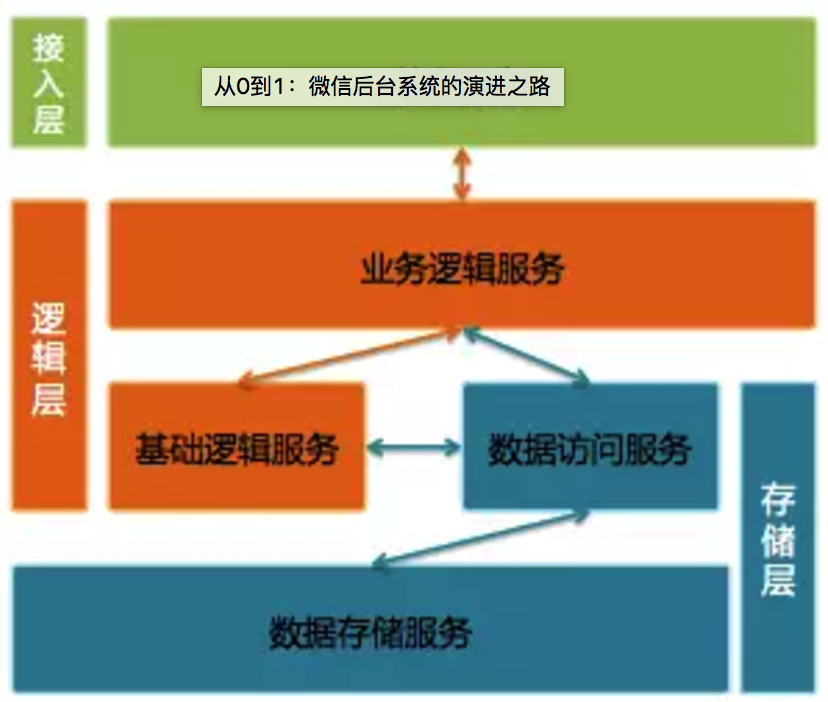
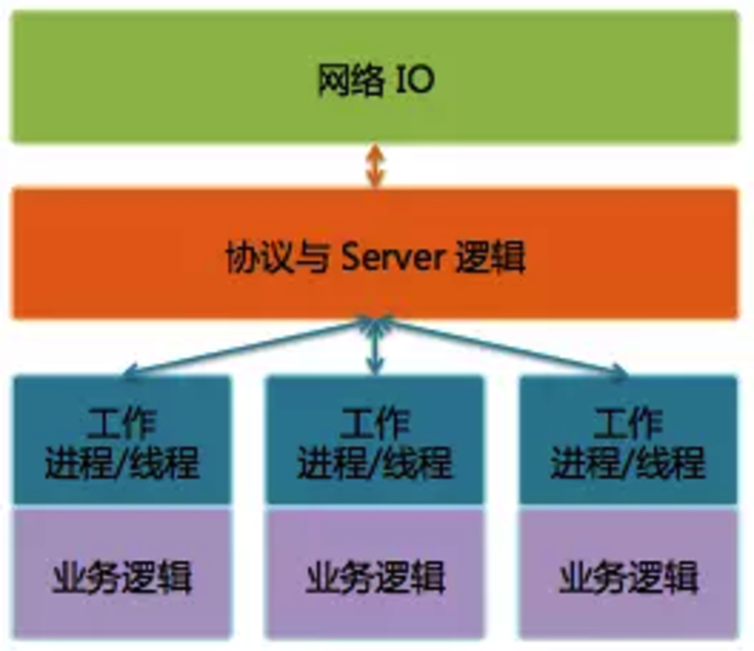

# 微信后台演进

出处：   

* [从无到有：微信后台系统的演进之路](http://www.infoq.com/cn/articles/the-road-of-the-growth-weixin-background)
* [从0到1：微信后台系统的演进之路](http://36kr.com/p/5042290.html)

作者： 张文瑞

微信高级工程师，微信接入系统负责人

一直从事后台系统设计开发，早期涉足传统行业软件，后投身互联网。作为微信最早的后台开发之一，见证了微信从零开始到逐渐发展壮大的过程。

## 1、 从无到有  (2个月，2011.1.21之前)

2011.1.21 微信正式发布。这一天距离微信项目启动日约为2个月。

### 1.1、确定了微信的消息模型

微信起初定位是一个通讯工具, 最核心的功能是收发消息.

微信团队源于广硏团队，消息模型跟邮箱的邮件模型也很有渊源，都是存储转发。

      
图(1) 微信消息模型

* 消息被发出后，会先在后台临时存储；
* 为使接收者能更快接收到消息，会推送消息通知给接收者；
* 最后客户端主动到服务器收取消息。

### 1.2、制定了数据同步协议
用户的帐户、联系人和消息等数据都在服务器存储，如何将数据同步到客户端？ 

细节参考： [序列号生成算法](../../序列号生成算法/wechat-serial-number-generator-architecture.md)

为简化协议，通过一个统一的数据同步协议来同步用户所有的数据。

#### 1.2.1、最初的方案

1. 客户端记录一个本地数据的快照(Snapshot)
2. 需要同步数据时，将Snapshot带到服务器
3. 服务器通过计算Snapshot与服务器数据的差异，将差异数据发给客户端
4. 客户端再保存差异数据完成同步。

这套方案的问题：

* Snapshot会随着客户端数据的增多变得越来越大，同步时流量开销大；
* 客户端每次同步都要计算Snapshot，会带来额外的性能开销和实现复杂度。

#### 1.2.2 进化的方案
几经讨论后，方案改为:

1. 由服务计算Snapshot，
2. 在客户端同步数据时跟随数据一起下发给客户端，
3. 客户端无需理解Snapshot，只需存储起来，
4. 在下次数据同步数据时带上即可。

即    

* 服务器端会有一个算法知道目前同步的情况， 
* 客户端只要把完成同步后服务器最新给的Snapshot再次带上即可，而不用管它是哪种格式，哪种算法产生的。

Snapshot被设计得非常精简

* 是若干个Key-Value的组合，
* Key代表数据的类型，
* Value代表给到客户端的数据的最新版本号。
* Key有三个，分别代表：帐户数据、联系人和消息。

这个同步协议好处：

* 客户端同步完数据后，不需要额外的ACK协议来确认数据收取成功，同样可以保证不会丢数据：
* 只要客户端拿最新的Snapshot到服务器做数据同步，服务器即可确认上次数据已经成功同步完成，可以执行后续操作，例如清除暂存在服务的消息等等。

#### 1.2.3、过程中形成的指导原则：

* 精简方案、
* 减少流量开销、
* 尽量由服务器完成较复杂的业务逻辑、
* 降低客户端实现的复杂度

案例：

在微信1.2版实现了群聊功能，但为了保证新旧版客户端间的群聊体验，我们通过服务器适配，让1.0版客户端也能参与群聊。

### 1.3、 定型了后台架构

#### 1.3.1、微信后台使用三层架构：
接入层、逻辑层和存储层。

      
图(2) 微信后台系统架构

##### 1.3.1.1 接入层
接入层提供接入服务，包括长连接入服务和短连接入服务。

* 长连接入服务同时支持客户端主动发起请求和服务器主动发起推送；
* 短连接入服务则只支持客户端主动发起请求。

##### 1.3.1.2 逻辑层
逻辑层包括业务逻辑服务和基础逻辑服务。

+ 业务逻辑服务封装了业务逻辑，是后台提供给微信客户端调用的API。
+ 基础逻辑服务则抽象了更底层和通用的业务逻辑，提供给业务逻辑服务访问。

##### 1.3.1.3 存储层
存储层包括数据访问服务和数据存储服务。

+ 数据存储服务通过MySQL和SDB(广硏早期后台中广泛使用的Key-Table数据存储系统)等底层存储系统来持久化用户数据。
+ 数据访问服务适配并路由数据访问请求到不同的底层数据存储服务，面向逻辑层提供结构化的数据服务。

比较特别的是，微信后台每一种不同类型的数据都使用单独的数据访问服务和数据存储服务，例如帐户、消息和联系人等等都是独立的。

#### 1.3.2、 Svrkit RPC 框架

微信后台主要使用C++。后台服务使用Svrkit框架搭建，服务之间通过同步RPC进行通讯。

       
图(3) Svrkit 框架

Svrkit是另一个广硏后台就已经存在的高性能RPC框架，当时尚未广泛使用，但在微信后台却大放异彩。

作为微信后台基础设施中最重要的一部分，Svrkit这几年一直不断在进化。

使用Svrkit构建了数以千计的服务模块，提供数万个服务接口，每天RPC调用次数达几十万亿次。

### 1.4、 运营支撑系统

有一个经验教训——运营支撑系统真的很重要。

第一个版本的微信后台是仓促完成的，当时只是完成了基础业务功能，并没有配套的业务数据统计等等。

我们在开放注册后，一时间竟没有业务监控页面和数据曲线可以看，注册用户数是临时从数据库统计的，在线数是从日志里提取出来的，这些数据通过每个小时运行一次的脚本（这个脚本也是当天临时加的）统计出来，然后自动发邮件到邮件组。

还有其他各种业务数据也通过邮件进行发布，可以说邮件是微信初期最重要的数据门户。

2011.1.21 当天最高并发在线数是 491，而今天这个数字是4亿。

## 2、 小步慢跑 （4个月，2011.8之前）

在微信发布后的4个多月里，我们经历了发布后火爆注册的惊喜，也经历了随后一直不温不火的困惑。

## 3、 快速成长

## 4、 平台化

## 5、 走出国门

## 6、 精耕细作

## 7、 新的挑战

