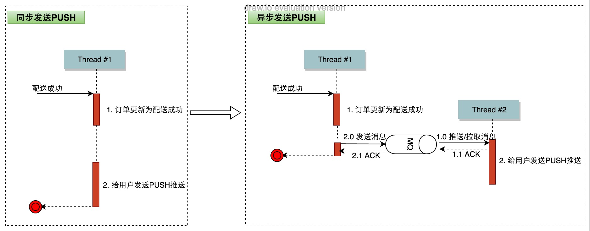

出处：
<http://tech.meituan.com/mt_waimai_order_evolution.html>

作者：何轼

# 业务特征
外卖订单特征：
1. 外卖订单业务是一个需要即时送的业务，对*实时性*要求很高。   
	从用户订餐到最终送达用户，一般在1小时内。

用户视角的订单流程图。

1. 从普通用户的角度来看，一个外卖订单从下单后，会经历支付、商家接单、配送、用户收货、售后及订单完成多个阶段。

2. 以技术的视角来分解的话，每个阶段依赖于多个子服务来共同完成，比如下单会依赖于购物车、订单预览、确认订单服务，这些子服务又会依赖于底层基础系统来完成其功能。

下图是一天内的外卖订单量分布图

外卖业务具有如下特征：

* 流程较长且实时性要求高；
* 订单量高且集中

# 演化过程

1. 订单业务模块
2. 独立的订单系统
3. 高性能、高可用、高稳定的订单系统
4. 可扩展的订单系统(分库分表)
5. 智能运维的订单系统

## 订单系统雏型

需求：

外卖业务发展早期，第一目标是要能够快速验证业务的可行性。   
技术上，我们需要保证架构足够灵活、快速迭代从而满足业务快速试错的需求。

在这个阶段，我们将订单相关功能组织成模块，与其它模块（门店模块等）一起形成公用jar包，然后各个系统通过引入jar包来使用订单功能。

通过jar包实现后集成到各端应用，应用开发部署相对简单。比较适合业务早期逻辑简单、业务量较小、需要快速迭代的情况。

但是，随着业务逻辑的复杂、业务量的增长，单应用架构的弊端逐步暴露出来。系统复杂后，大家共用一个大项目进行开发部署，协调的成本变高；业务之间相互影响的问题也逐渐增多。

## 独立的订单系统

2014年4月，外卖订单量达到了*10万单/日*，而且订单量还在持续增长。

这时候，业务大框架基本成型，业务在大框架基础上快速迭代。大家共用一个大项目进行开发部署，相互影响，协调成本变高；多个业务部署于同一VM，相互影响的情况也在增多。

系统拆分主要有如下几个原则：

* 相关业务拆分独立系统；
* 优先级一致的业务拆分独立系统；
* 拆分系统包括业务服务和数据。

订单系统的拆分方法：

* 订单服务通过RPC接口提供给外部使用。
* 订单系统内部，我们将功能按优先级拆分为不同子系统，避免相互影响。
* 订单系统通过MQ（队列）消息，通知外部订单状态变更。

独立拆分后的订单系统架构如下所示：

* 最底层是数据存储层，订单相关数据独立存储。
* 订单服务层，我们按照优先级将订单服务划分为三个系统，分别为实时交易系统、订单查询系统、异步处理系统。

## 高性能、高可用、高稳定的订单系统
订单系统经过上述独立拆分后，有效地避免了业务间的相互干扰，保障迭代速度的同时，保证了系统稳定性。

这时，我们的订单量突破百万，而且还在持续增长。之前的一些小问题，在订单量增加后，被放大，进而影响用户体验。比如，用户支付成功后，极端情况下（比如网络、数据库问题）会导致支付成功消息处理失败，用户支付成功后依然显示未支付。订单量变大后，问题订单相应增多。我们需要提高系统的可靠性，保证订单功能稳定可用。

这个阶段主要对订单系统的性能、稳定性、可用性进行改进。

### 性能优化

#### 异步化
异步化方案：

* 线程或线程池：将异步操作放在单独线程中处理，避免阻塞服务线程；
* 消息异步：异步操作通过接收消息完成。

异步化带来一个隐患，如何保障异步操作的执行。

这个场景主要发生在应用重启时，对于通过线程或线程池进行的异步化，JVM重启时，后台执行的异步操作可能尚未完成。

这时，需要通过JVM优雅关闭来保证异步操作进行完成后，JVM再关闭。

通过消息来进行的，消息本身已提供持久化，不受应用重启影响。

具体到订单系统，我们通过将部分不必同步进行的操作异步化，来提升对外服务接口的性能。不需要立即生效的操作即可以异步进行，比如发放红包、PUSH推送、统计等。

以订单配送PUSH推送为例，将PUSH推送异步化后的处理流程变更如下所示：

PUSH异步化后，线程#1在更新订单状态、发送消息后立即返回，而不用同步等待PUSH推送完成。而PUSH推送异步在线程#2中完成。

#### 并行化
操作并行化也是提升性能的一大利器，并行化将原本串行的工作并行执行，降低整体处理时间。我们对所有订单服务进行分析，将其中非相互依赖的操作并行化，从而提升整体的响应时间。

以用户下单为例，第一步是从各个依赖服务获取信息，包括门店、菜品、用户信息等。获取这些信息并不需要相互依赖，故可以将其并行化，并行后的处理流程变更如下所示：

通过将获取信息并行化，可有效缩短下单时间，提升下单接口性能。

#### 缓存

通过将统计信息进行提前计算后缓存，避免获取数据时进行实时计算，从而提升获取统计数据的服务性能。比如对于首单、用户已减免配送费等，通过提前计算后缓存，可以简化实时获取数据逻辑，节约时间。

以用户已减免配送费为例，如果需要实时计算，则需要取到用户所有订单后，再进行计算，这样实时计算成本较高。我们通过提前计算，缓存用户已减免配送费。需要取用户已减免配送费时，从缓存中取即可，不必实时计算。具体来说，包括如下几点：

* 通过缓存保存用户已减免配送费；
* 用户下单时，如果订单有减免配送费，增加缓存中用户减免配送费金额（异步进行）；
* 订单取消时，如果订单有减免配送费，减少缓存中用户减免配送费金额（异步进行）；

### 一致性优化

订单交易系统的事务性，并不要求严格满足传统数据库事务的ACID性质，只需要*最终结果一致*即可.

#### 重试/幂等

通过延时重试，保证操作最终会最执行。

比如退款操作，如退款时遇到网络或支付平台故障等问题，会延时进行重试，保证退款最终会被完成。

重试又会带来另一个问题，即部分操作重复进行，需要对操作进行幂等处理，保证重试的正确性。

退款操作首先会检查是否已经退款，如果已经退款，直接返回。否则，向支付平台发起退款，从而保证操作幂等，避免重复操作带来问题。如果发起退款失败（比如网络或支付平台故障），会将任务放入延时队列，稍后重试。否则，直接返回。

通过重试+幂等，可以保证退款操作最终一定会完成。

#### 2PC

2PC是指分布式事务的两阶段提交，通过2PC来保证多个系统的数据一致性。比如下单过程中，涉及库存、优惠资格等多个资源，下单时会首先预占资源（对应2PC的第一阶段），下单失败后会释放资源（对应2PC的回滚阶段），成功后会使用资源（对应2PC的提交阶段）。

### 高可用

订单系统而言，其主要组成组件包括三类：存储层、中间件层、服务层。

#### 存储层
存储层的组件如MYSQL、ES等本身已经实现了高可用，比如MYSQL通过主从集群、ES通过分片复制来实现高可用。存储层的高可用依赖各个存储组件即可。

#### 中间件层
分布式系统会大量用到各类中间件，比如服务调用框架等，这类中间件一般使用开源产品或由公司基础平台提供，本身已具备高可用。

#### 服务层
在分布式系统中，服务间通过相互调用来完成业务功能，一旦某个服务出现问题，会级联影响调用方服务，进而导致系统崩溃。分布式系统中的依赖容灾是影响服务高可用的一个重要方面。

依赖容灾主要有如下几个思路

* 依赖超时设置；
* 依赖灾备；
* 依赖降级；
* 限制依赖使用资源；

订单系统会依赖多个其它服务，也存在这个问题。当前订单系统通过同时采用上述四种方法，来避免底层服务出现问题时，影响整体服务。具体实现上，我们采用Hystrix框架来完成依赖容灾功能。Hystrix框架采用上述四种方法，有效实现依赖容灾。订单系统依赖容灾示意图如下所示

通过为每个依赖服务设置独立的线程池、合理的超时时间及出错时回退方法，有效避免服务出现问题时，级联影响，导致整体服务不可用，从而实现服务高可用。

另外，订单系统服务层都是无状态服务，通过集群+多机房部署，可以避免单点问题及机房故障，实现高可用。

交易系统tp99为150ms、查询系统tp99时间为40ms。整体系统可用性为6个9。

### 可扩展的订单系统

部分服务只能通过垂直扩展（增加服务器配置）而不能通过水平扩展（加机器）来进行扩容。到2015年5月的时候，这个问题就比较突出了。

#### 存储层

##### 分库分表
分库，即将不同表放不同库不同机器上。

外卖主要涉及三个查询维度：订单ID、用户ID、门店ID。对订单表分表时，对于一个订单，我们存三份，分别按照订单ID、用户ID、 门店ID以一定规则存储在每个维度不同分片中。这样，可以分散写压力，同时，按照订单ID、用户ID、门店ID三个维度查询时，数据均在一个分片，保证较高的查询效率。

可以看到，分表后，每个维度共有100张表，分别放在4个库上面。对于同一个订单，冗余存储了三份。

分库分表插件的实现包括如下几个要点:

* 配置文件管理分库分表配置信息；
* JAVA注解说明SQL语句分库分表信息；
* JAVA AOP解析注解+查询配置文件，获取数据源及表名；
* MYBATIS动态替换表名；
* SPRING动态替换数据源。

##### ES搜索

订单表分表之后，对于ID、用户ID、门店ID外的查询（比如按照手机号前缀查询）存在效率问题。这部分通常是复杂查询，可以通过全文搜索来支持。在订单系统中，我们通过ES来解决分表后非分表维度的复杂查询效率问题。具体来说，使用ES，主要涉及如下几点。

* 通过databus将订单数据同步到ES。
* 同步数据时，通过批量写入来降低ES写入压力。
* 通过ES的分片机制来支持扩展性。

### 智能运维的订单系统

早期，对系统及业务的运维主要是采用人肉的方式，即外部反馈问题，RD通过排查日志等来定位问题。随着系统的复杂、业务的增长，问题排查难度不断加大，同时反馈问题的数量也在逐步增多。

#### 事前措施

* 定期线上压测：通过线上压测，准确评估系统容量，提前发现系统隐患；
* 周期性系统健康体检：通过周期检测CPU利用率、内存利用率、接口QPS、接口TP95、异常数，取消订单数等指标是否异常，可以提前发现提前发现潜在问题、提前解决；
* 全链路关键日志：通过记录全链路关键日志，根据日志，自动分析反馈订单问题原因，给出处理结果，有效提高反馈处理效率。

#### 事中措施

* 订单监控大盘：实时监控订单业务指标，异常时报警；
* 系统监控大盘：实时监控订单系统指标，异常时报警；
* 完善的SOP：报警后，通过标准流程，快速定位问题、解决问题。

#### 事后措施

事后措施是指问题发生后，分析问题原因，彻底解决。并将相关经验教训反哺给事前、事中措施，不断加强事先、事中措施，争取尽量提前发现问题，将问题扼杀在萌芽阶段。

