# 单点系统架构的可用性与性能优化

出处：
[单点系统架构的可用性与性能优化](http://mp.weixin.qq.com/s?__biz=MjM5ODYxMDA5OQ==&mid=2651959480&idx=1&sn=337bd74410a6bef616128fd17abd08a8&scene=21#wechat_redirect)

作者： 58沈剑

## 单点例子
为何系统中还会存在单点？      
回答：单点master的设计，会大大简化系统设计，何况有时候避免不了单点。

### 典型互联网高可用架构

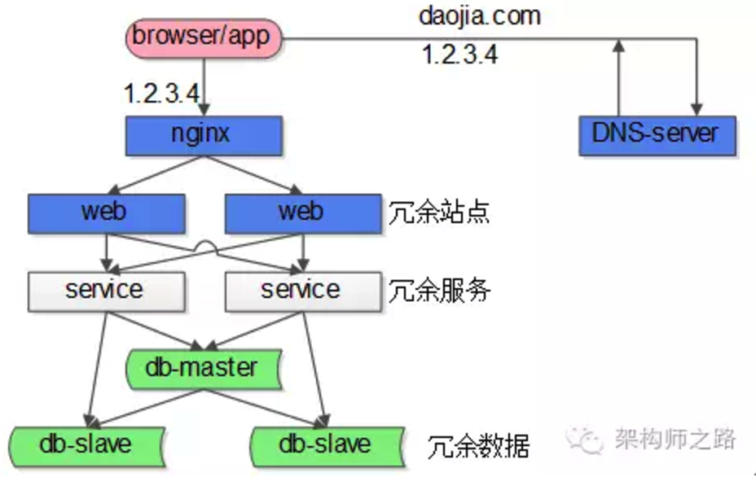

1. 客户端层，这一层是浏览器或者APP，第一步先访问DNS-server，由域名拿到nginx的外网IP
2. 负载均衡层，nginx是整个服务端的入口，负责反向代理与负载均衡工作
3. 站点层，web-server层，典型的是tomcat或者apache
4. 服务层，service层，典型的是dubbo或者thrift等提供RPC调用的后端服务
5. 数据层，包含cache和db，典型的是主从复制读写分离的db架构

在这个互联网架构中，站点层、服务层、数据库的从库都可以通过冗余的方式来保证高可用，但至少

1. nginx层是一个潜在的单点
2. 数据库写库master也是一个潜在的单点

### GFS（Google File System）架构

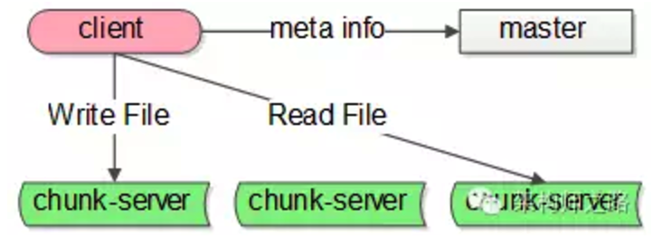

GFS的系统架构里主要有这么几种角色：

1. client，就是发起文件读写的调用端
2. master，这是一个单点服务，它有全局事业，掌握文件元信息
3. chunk-server，实际存储文件额服务器

这个系统里，master也是一个单点的服务，Map-reduce系统里也有类似的全局协调的master单点角色。

## 单点架构存在的问题

单点系统一般来说存在两个很大的问题：

* 非高可用：既然是单点，master一旦发生故障，服务就会受到影响
* 性能瓶颈：既然是单点，不具备良好的扩展性，服务性能总有一个上限，这个单点的性能上限往往就是整个系统的性能上限

## shadow-master解决单点高可用问题
*shadow-master是一种很常见的解决单点高可用问题的技术方案。*

“影子master”，顾名思义，服务正常时，它只是单点master的一个影子，在master出现故障时，shadow-master会自动变成master，继续提供服务。

shadow-master它能够解决高可用的问题，并且故障的转移是自动的，不需要人工介入，但不足是*它使服务资源的利用率降为了50%*，业内经常使用keepalived+vip的方式实现这类单点的高可用。

以GFS的master为例，master正常时：

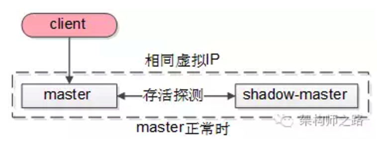

1. client会连接正常的master，shadow-master不对外提供服务
2. master与shadow-master之间有一种存活探测机制
3. master与shadow-master有相同的虚IP（virtual-IP）

当发现master异常时：

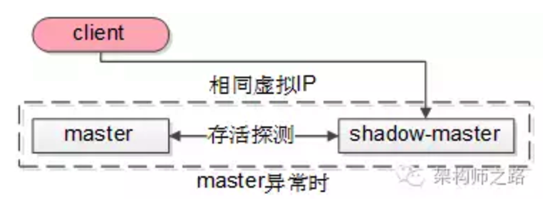

shadow-master会自动顶上成为master，虚IP机制可以保证这个过程对调用方是透明的

除了GFS与MapReduce系统中的主控master，nginx亦可用类似的方式保证高可用，数据库的主库master（主库）亦可用类似的方式来保证高可用，只是细节上有些地方要注意：

传统的一主多从，读写分离的db架构，只能保证读库的高可用，是无法保证写库的高可用的，

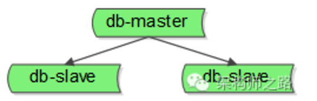

要想保证写库的高可用，也可以使用上述的shadow-master机制：

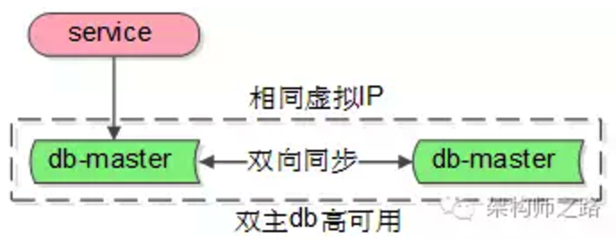

1. 两个主库设置相互同步的双主模式
2. 平时只有一个主库提供服务，言下之意，shadow-master不会往master同步数据
3. 异常时，虚IP漂移到另一个主库，shadow-master变成主库继续提供服务

需要说明的是，由于数据库的特殊性，数据同步需要时延，如果数据还没有同步完成，流量就切到了shadow-master，可能引起小部分数据的不一致。

## 减少与单点的交互，是存在单点的系统优化的核心方向

减少与单点的交互，便成了存在单点的系统优化的核心方向。

怎么来减少与单点的交互，这里提两种常见的方法。

### 批量写

批量写是一种常见的提升单点性能的方式。

例如一个利用数据库写单点生成做“ID生成器”的例子：

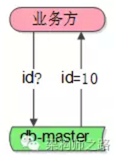

1. 业务方需要ID
2. 利用数据库写单点的auto increament id来生成和返回ID

这是一个很常见的例子，很多公司也就是这么生成ID的，它利用了数据库写单点的特性，方便快捷，无额外开发成本，是一个非常帅气的方案。

潜在的问题是：生成ID的并发上限，取决于单点数据库的写性能上限。

如何提升性能呢？批量写

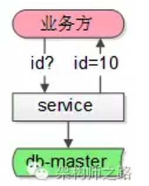

1. 中间加一个服务，每次从数据库拿出100个id
2. 业务方需要ID
3. 服务直接返回100个id中的1个，100个分配完，再访问数据库

这样一来，每分配100个才会写数据库一次，分配id的性能可以认为提升了100倍。

### 客户端缓存
客户端缓存也是一种降低与单点交互次数，提升系统整体性能的方法。

还是以GFS文件系统为例：

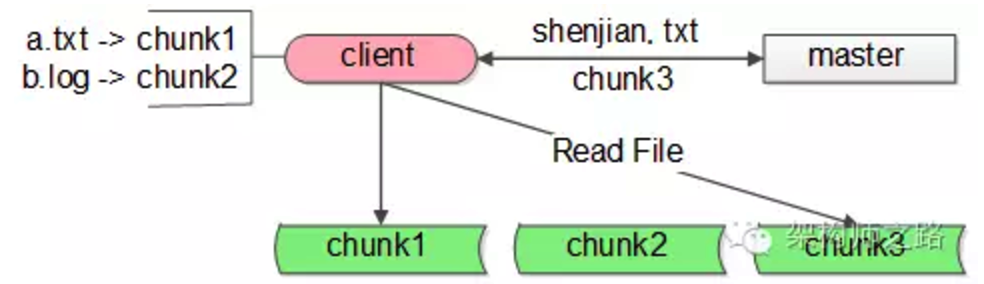

1. GFS的调用客户端client要访问shenjian.txt，先查询本地缓存，miss了
2. client访问master问说文件在哪里，master告诉client在chunk3上
3. client把shenjian.txt存放在chunk3上记录到本地的缓存，然后进行文件的读写操作
4. 未来client要访问文件，从本地缓存中查找到对应的记录，就不用再请求master了，可以直接访问chunk-server。如果文件发生了转移，chunk3返回client说“文件不在我这儿了”，client再访问master，询问文件所在的服务器。
 
根据经验，这类缓存的命中非常非常高，可能在99.9%以上（因为文件的自动迁移是小概率事件），这样与master的交互次数就降低了1000倍。

## 水平扩展是提升单点系统性能的好方案
无论怎么批量写，客户端缓存，单点毕竟是单机，还是有性能上限的。

想方设法水平扩展，消除系统单点，理论上才能够无限的提升系统系统。

以nginx为例，如何来进行水平扩展呢？

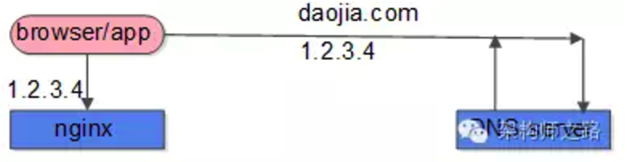

第一步的DNS解析，只能返回一个nginx外网IP么？

答案显然是否定的，“DNS轮询”技术支持DNS-server返回不同的nginx外网IP，这样就能实现nginx负载均衡层的水平扩展。

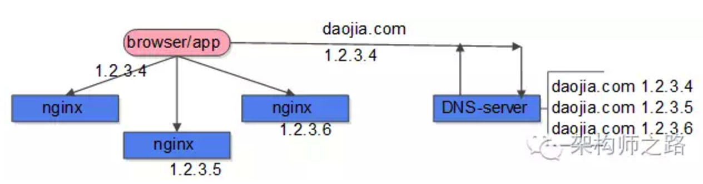

DNS-server部分，一个域名可以配置多个IP，每次DNS解析请求，轮询返回不同的IP，就能实现nginx的水平扩展，扩充负载均衡层的整体性能。

数据库单点写库也是同样的道理，在数据量很大的情况下，可以通过水平拆分，来提升写入性能。

并不是所有的业务场景都可以水平拆分，例如秒杀业务，商品的条数可能不多，数据库的数据量不大，就不能通过水平拆分来提升秒杀系统的整体写性能（总不能一个库100条记录吧？）。

