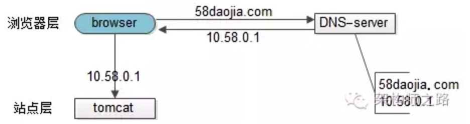
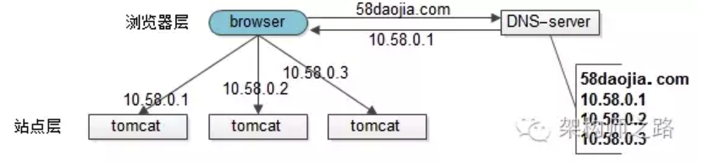
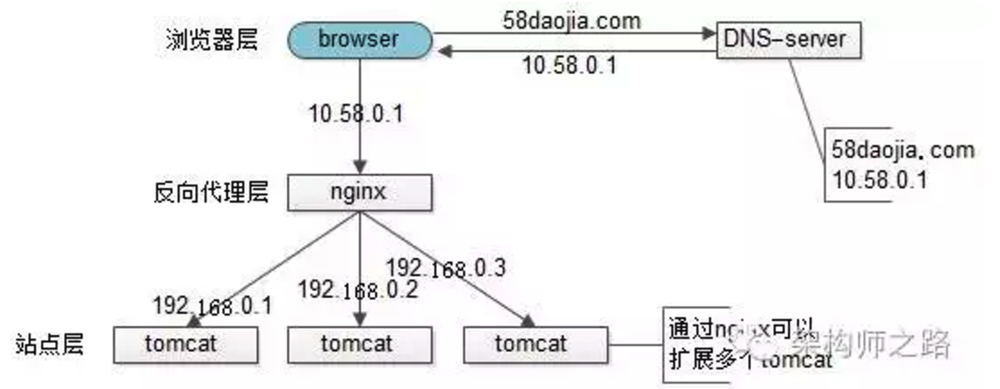
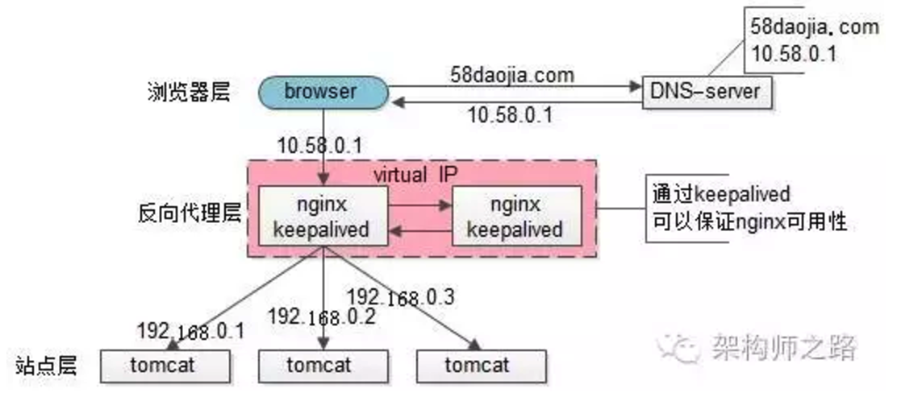
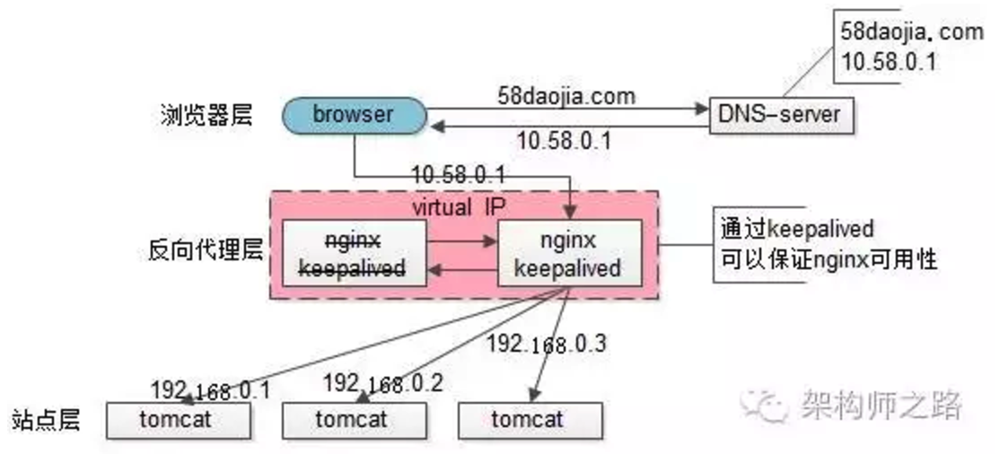
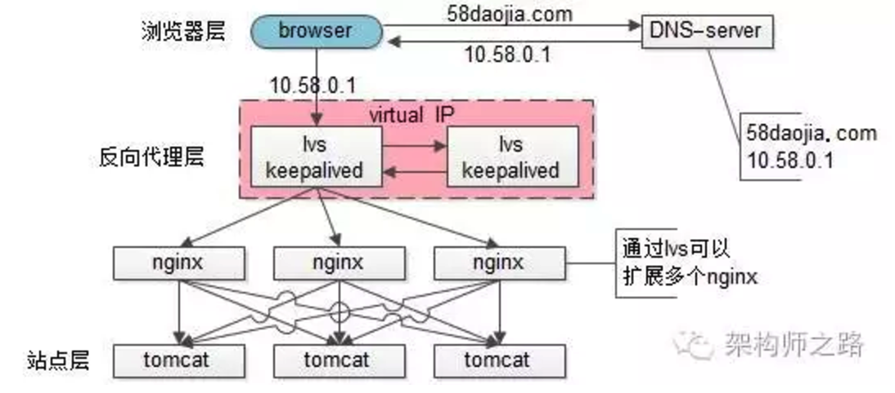
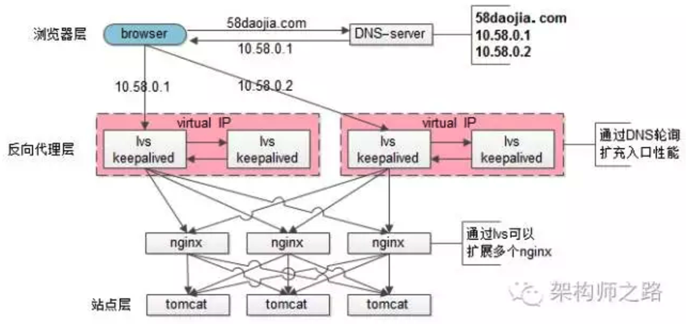

# 接入层负载均衡架构技术演进
 
 出处：[lvs为何不能完全替代DNS轮询](http://chuansong.me/n/802289746436)
 
 作者： 58沈剑
 
 接入层架构技术演进
 
## 接入层一般涉及名次：

* nginx：一个高性能的web-server和实施反向代理的软件。
* lvs：Linux Virtual Server，使用集群技术，实现在linux操作系统层面的一个高性能、高可用、负载均衡服务器。
* keepalived：一款用来检测服务状态存活性的软件，常用来做高可用。
* f5：一个高性能、高可用、负载均衡的硬件设备（听上去和lvs功能差不多？）
* DNS轮询：通过在DNS-server上对一个域名设置多个ip解析，来扩充web-server性能及实施负载均衡的技术。

## 接入层需要解决的问题：
* 可用性：任何一台机器挂了，服务受不受影响。
* 扩展性：能否通过增加机器，扩充系统的性能。
* 反向代理+负载均衡：请求是否均匀分摊到后端的操作单元执行。

## 接入层技术演进

### 【裸奔时代（0）单机架构】

裸奔时代的架构图如上：

1. 浏览器通过DNS-server，域名解析到ip
2. 浏览器通过ip访问web-server

缺点：

1. 非高可用，web-server挂了整个系统就挂了
2. 扩展性差，当吞吐量达到web-server上限时，无法扩容

注：单机不涉及负载均衡的问题

### 【简易扩容方案（1）DNS轮询】
假设tomcat的吞吐量是1000次每秒，当系统总吞吐量达到3000时，*如何扩容是首先要解决的问题*，DNS轮询是一个很容易想到的方案：

此时的架构图如上：

1. 多部署几份web-server，1个tomcat抗1000，部署3个tomcat就能抗3000
2. 在DNS-server层面，域名每次解析到不同的ip

优点：

1. 零成本：在DNS-server上多配几个ip即可，功能也不收费
2. 部署简单：多部署几个web-server即可，原系统架构不需要做任何改造
3. 负载均衡：变成了多机，但负载基本是均衡的

缺点：

1. 非高可用：DNS-server只负责域名解析ip，这个ip对应的服务是否可用，DNS-server是不保证的，假设有一个web-server挂了，部分服务会受到影响
2. 扩容非实时：DNS解析有一个生效周期
3. 暴露了太多的外网ip

### 【简易扩容方案（2）nginx】

tomcat的性能较差，但nginx作为反向代理的性能就强多了，假设线上跑到1w，就比tomcat高了10倍，可以利用这个特性来做扩容：

此时的架构图如上：

1. 站点层与浏览器层之间加入了一个反向代理层，利用高性能的nginx来做反向代理
2. nginx将http请求分发给后端多个web-server

优点：

1. DNS-server不需要动
2. 负载均衡：通过nginx来保证
3. 只暴露一个外网ip，nginx->tomcat之间使用内网访问
4. 扩容实时：nginx内部可控，随时增加web-server随时实时扩容
5. 能够保证站点层的可用性：任何一台tomcat挂了，nginx可以将流量迁移到其他tomcat

缺点：

1. 时延增加+架构更复杂了：中间多加了一个反向代理层
2. 反向代理层成了单点，非高可用：tomcat挂了不影响服务，nginx挂了怎么办？

### 【高可用方案（3）keepalived】

为了解决高可用的问题，keepalived出场了：

此时：

1. 做两台nginx组成一个集群，分别部署上keepalived，设置成相同的虚IP，保证nginx的高可用
2. 当一台nginx挂了，keepalived能够探测到，并将流量自动迁移到另一台nginx上，整个过程对调用方透明

优点：

1. 解决了高可用的问题

缺点：

1. 资源利用率只有50%
2. nginx仍然是接入单点，如果接入吞吐量超过的nginx的性能上限怎么办，例如qps达到了50000咧？

###【scale up扩容方案（4）lvs/f5】
nginx毕竟是软件，性能比tomcat好，但总有个上限，超出了上限，还是扛不住。

lvs就不一样了，它实施在操作系统层面；f5的性能又更好了，它实施在硬件层面；它们性能比nginx好很多，例如每秒可以抗10w，这样可以利用他们来扩容，常见的架构图如下：

此时：

1. 如果通过nginx可以扩展多个tomcat一样，可以通过lvs来扩展多个nginx
2. 通过keepalived+VIP的方案可以保证可用性
99.9999%的公司到这一步基本就能解决接入层高可用、扩展性、负载均衡的问题。
 
这就完美了嘛？还有潜在问题么？

好吧，不管是使用lvs还是f5，这些都是scale up的方案，根本上，lvs/f5还是会有性能上限，假设每秒能处理10w的请求，一天也只能处理80亿的请求（10w秒吞吐量*8w秒），那万一系统的日PV超过80亿怎么办呢？（好吧，没几个公司要考虑这个问题）

 
###【scale out扩容方案（5）DNS轮询】
如之前文章所述，水平扩展，才是解决性能问题的根本方案，能够通过加机器扩充性能的方案才具备最好的扩展性。

facebook，google，baidu的PV是不是超过80亿呢，它们的域名只对应一个ip么，终点又是起点，还是得通过DNS轮询来进行扩容：

此时：

1. 通过DNS轮询来线性扩展入口lvs层的性能
2. 通过keepalived来保证高可用
3. 通过lvs来扩展多个nginx
4. 通过nginx来做负载均衡，业务七层路由

### 58到家、旺POS架构

在阿里云上，前端购买了SLB服务（可以先粗暴的认为是一个lvs+keepalived的高可用负载均衡服务），后端是nginx+tomcat。

 