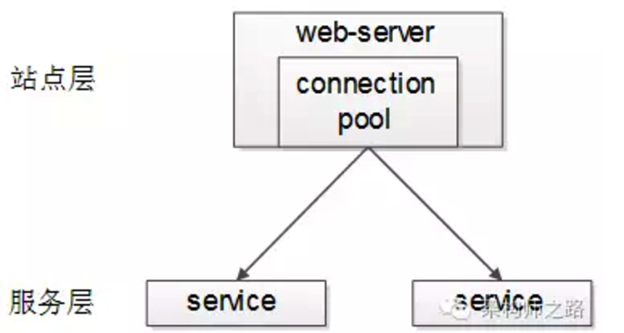

# 每一层的负载均衡

出处：
[一分钟了解负载均衡的一切](https://mp.weixin.qq.com/s?__biz=MjM5ODYxMDA5OQ==&mid=2651959585&idx=1&sn=0a9222cbfeb62a662edffafb7f0b43ae&scene=25&uin=MTk3MTg4NjAwMg%3D%3D&key=1a6dc58b177dc6263f3496f81fbeb4fc9ea537b0298efce416b60419ee34d2d02728255ac494b4d441a4fbccd2e2f7e2&devicetype=iMac+MacBookPro11%2C4+OSX+OSX+10.11.6+build(15G1004)&version=12000310&lang=zh_CN&nettype=WIFI&fontScale=100&pass_ticket=Nu3egiWix36HOcKRKTsH39QhMvbXrVuVfPuA%2BHNMy%2B7%2B3nyLxQ1DX8YLfQrEZHGj)

作者： 58沈剑

## 负载均衡（Load Balance）
将请求/数据*【均匀】*分摊到多个操作单元上执行

常见互联网分布式架构会分为:

* 客户端层
* 反向代理nginx层
* 站点层
* 服务层
* 数据层

每一层的*每一个上游都做到均匀访问每一个下游*，就能实现“将请求/数据【均匀】分摊到多个操作单元上执行”。

##【客户端层->反向代理层】的负载均衡

【客户端层】到【反向代理层】的负载均衡，是通过“DNS轮询”实现的：

DNS-server对于一个域名配置了多个解析ip，每次DNS解析请求来访问DNS-server，DNS-server会轮询返回这些ip，保证每个ip的解析概率是相同的。

这些ip就是nginx的外网ip，以做到每台nginx的请求分配也是均衡的。

##【反向代理层->站点层】的负载均衡

【反向代理层】到【站点层】的负载均衡，是通过“nginx”实现的。通过修改nginx.conf，可以实现多种负载均衡策略：

1. 请求轮询：和DNS轮询类似，请求依次路由到各个web-server
2. 最少连接路由：哪个web-server的连接少，路由到哪个web-server
3. ip哈希：按照访问用户的ip哈希值来路由web-server，只要用户的ip分布是均匀的，请求理论上也是均匀的，ip哈希均衡方法可以做到，同一个用户的请求固定落到同一台web-server上，此策略适合有状态服务，例如session（58沈剑备注：可以这么做，但强烈不建议这么做，站点层无状态是分布式架构设计的基本原则之一）
4. …

##【站点层->服务层】的负载均衡

【站点层】到【服务层】的负载均衡，是通过“服务连接池”实现的。
上游连接池会建立与下游服务多个连接，每次请求会“随机”选取连接来访问下游服务。

##【数据层】的负载均衡

在数据量很大的情况下，由于数据层（db，cache）涉及数据的水平切分，所以数据层的负载均衡更为复杂一些，它分为“数据的均衡”，与“请求的均衡”。

* 数据的均衡是指：水平切分后的每个服务（db，cache），数据量是差不多的。
* 请求的均衡是指：水平切分后的每个服务（db，cache），请求量是差不多的。

业内常见的水平切分方式有这么几种：

### 一、按照range水平切分

每一个数据服务，存储一定范围的数据，下图为例：

* user0服务，存储uid范围1-1kw
* user1服务，存储uid范围1kw-2kw

这个方案的好处是：

1. 规则简单，service只需判断一下uid范围就能路由到对应的存储服务
2. 数据均衡性较好
3. 比较容易扩展，可以随时加一个uid[2kw,3kw]的数据服务

不足是：

1. 请求的负载不一定均衡，一般来说，新注册的用户会比老用户更活跃，大range的服务请求压力会更大

### 二、按照id哈希水平切分

每一个数据服务，存储某个key值hash后的部分数据，下图为例：

* user0服务，存储偶数uid数据
* user1服务，存储奇数uid数据

这个方案的好处是：

1. 规则简单，service只需对uid进行hash能路由到对应的存储服务
2. 数据均衡性较好
3. 请求均匀性较好

不足是：

1. 不容易扩展，扩展一个数据服务，hash方法改变时候，可能需要进行数据迁移

